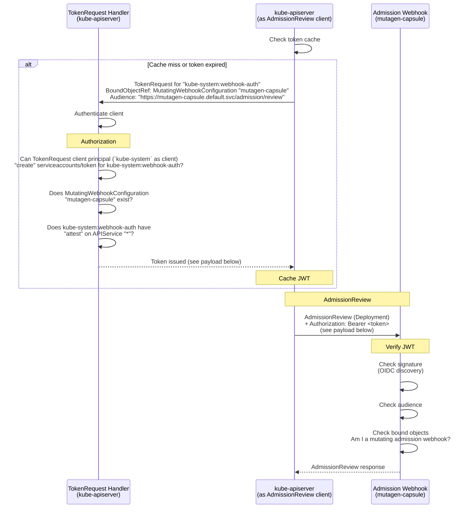
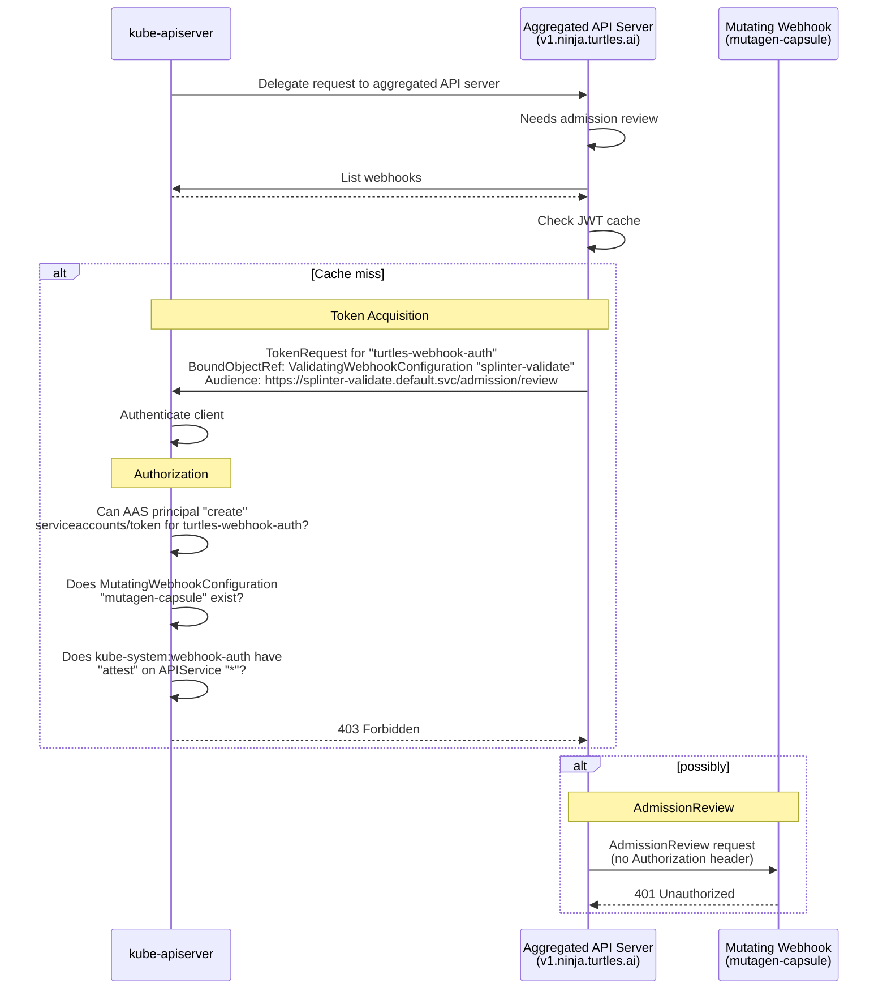
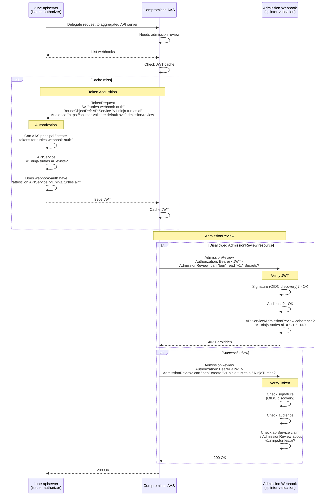

# KEP-6060: API Server Authentication to Admission Webhooks

<!-- toc -->
- [Release Signoff Checklist](#release-signoff-checklist)
- [Summary](#summary)
- [Motivation](#motivation)
  - [Goals](#goals)
  - [Non-Goals](#non-goals)
- [Terms](#terms)
  - [Token Acquisition Service Account](#token-acquisition-service-account)
  - [Webhook Authentication Client](#webhook-authentication-client)
  - [Aggregated API Servers and <code>kube-apiserver</code>](#aggregated-api-servers-and-kube-apiserver)
  - [Webhook Authentication Bound Object Types](#webhook-authentication-bound-object-types)
- [Proposal](#proposal)
  - [Sequence Diagrams](#sequence-diagrams)
    - [Flow 1: <code>kube-apiserver</code> as Webhook Client](#flow-1-kube-apiserver-as-webhook-client)
      - [JWT payload](#jwt-payload)
    - [Flow 2: <code>kube-apiserver</code> denies a suspicious request](#flow-2-kube-apiserver-denies-a-suspicious-request)
    - [Flow 3: Aggregated API Server denied/accepted by webhook](#flow-3-aggregated-api-server-deniedaccepted-by-webhook)
      - [JWT payload (both requests)](#jwt-payload-both-requests)
  - [Risks and Mitigations](#risks-and-mitigations)
    - [Token replay across webhooks](#token-replay-across-webhooks)
    - [Token replay across API groups](#token-replay-across-api-groups)
    - [Service account compromise](#service-account-compromise)
    - [Increased authorization load](#increased-authorization-load)
- [Design Details](#design-details)
  - [Token Acquisition (from the client perspective)](#token-acquisition-from-the-client-perspective)
    - [All webhook authentication clients:](#all-webhook-authentication-clients)
    - [<code>kube-apiserver</code>:](#kube-apiserver)
    - [Aggregated API Servers:](#aggregated-api-servers)
  - [Authorization Checks](#authorization-checks)
  - [New types of BoundObjectRef](#new-types-of-boundobjectref)
    - [Synthetic <code>&quot;*&quot;</code> APIService](#synthetic--apiservice)
  - [Audience](#audience)
  - [New JWT Private Claims](#new-jwt-private-claims)
  - [Token Verification](#token-verification)
  - [Token Caching and Rotation](#token-caching-and-rotation)
  - [Test Plan](#test-plan)
      - [Prerequisite testing updates](#prerequisite-testing-updates)
      - [Unit tests](#unit-tests)
      - [Integration tests](#integration-tests)
      - [e2e tests](#e2e-tests)
  - [Graduation Criteria](#graduation-criteria)
    - [Alpha](#alpha)
    - [Beta](#beta)
    - [GA](#ga)
  - [Upgrade / Downgrade Strategy](#upgrade--downgrade-strategy)
  - [Version Skew Strategy](#version-skew-strategy)
- [Production Readiness Review Questionnaire](#production-readiness-review-questionnaire)
  - [Feature Enablement and Rollback](#feature-enablement-and-rollback)
  - [Rollout, Upgrade and Rollback Planning](#rollout-upgrade-and-rollback-planning)
  - [Monitoring Requirements](#monitoring-requirements)
  - [Dependencies](#dependencies)
  - [Scalability](#scalability)
  - [Troubleshooting](#troubleshooting)
- [Implementation History](#implementation-history)
- [Drawbacks](#drawbacks)
- [Alternatives](#alternatives)
  - [Client Certificates (mTLS)](#client-certificates-mtls)
  - [Designated ServiceAccount (&quot;Magic SA&quot;)](#designated-serviceaccount-magic-sa)
  - [ServiceAccount Token with Identity in Private Claims](#serviceaccount-token-with-identity-in-private-claims)
  - [AdmissionReview Delegation](#admissionreview-delegation)
<!-- /toc -->

## Release Signoff Checklist

Items marked with (R) are required *prior to targeting to a milestone / release*.

- [x] (R) Enhancement issue in release milestone, which links to KEP dir in [kubernetes/enhancements] (not the initial KEP PR)
- [x] (R) KEP approvers have approved the KEP status as `implementable`
- [x] (R) Design details are appropriately documented
- [x] (R) Test plan is in place, giving consideration to SIG Architecture and SIG Testing input (including test refactors)
  - [ ] e2e Tests for all Beta API Operations (endpoints)
  - [ ] (R) Ensure GA e2e tests meet requirements for [Conformance Tests](https://github.com/kubernetes/community/blob/master/contributors/devel/sig-architecture/conformance-tests.md)
  - [ ] (R) Minimum Two Week Window for GA e2e tests to prove flake free
- [ x (R) Graduation criteria is in place
  - [ ] (R) [all GA Endpoints](https://github.com/kubernetes/community/pull/1806) must be hit by [Conformance Tests](https://github.com/kubernetes/community/blob/master/contributors/devel/sig-architecture/conformance-tests.md) within one minor version of promotion to GA
- [x] (R) Production readiness review completed
- [x] (R) Production readiness review approved
- [x] "Implementation History" section is up-to-date for milestone
- [ ] User-facing documentation has been created in [kubernetes/website], for publication to [kubernetes.io]
- [ ] Supporting documentation---e.g., additional design documents, links to mailing list discussions/SIG meetings, relevant PRs/issues, release notes

[kubernetes.io]: https://kubernetes.io/
[kubernetes/enhancements]: https://git.k8s.io/enhancements
[kubernetes/kubernetes]: https://git.k8s.io/kubernetes
[kubernetes/website]: https://git.k8s.io/website

## Summary

Today, the kube-apiserver does not authenticate itself to admission webhooks
by default. Any entity with service network access can send requests to a webhook
endpoint and impersonate the kube-apiserver.
[CVE-2025-1974](https://nvd.nist.gov/vuln/detail/CVE-2025-1974) demonstrated
real-world consequences of this class of vulnerability.

The introduction of the capability to authenticate API Servers
consists of three main additions. First, [webhook authentication
clients](#webhook-authentication-client) will be updated to request a service
account token from `kube-apiserver`, and to present the credential to the
admission webhook. Second, `kube-apiserver` will be updated to dispense
those tokens to authenticated and authorized principals. Third, a token
verification library will be introduced for use by webhook maintainers.

This KEP augments the private claims of a service account token (JWT) to support
three new types of bound object, which will be included in the `TokenRequest`
made by the [webhook authentication client](#webhook-authentication-client). The
bound object may be one of `APIService`, `ValidatingWebhookConfiguration`,
or `MutatingWebhookConfiguration`.

A list of [terms](#terms) is provided below to prevent awkward sentence
constructions and for disambiguation.

## Motivation

Any entity with service network access can send requests to an admission webhook
endpoint. If the webhook does not authenticate the caller, an attacker can
probe for policy information, trigger unintended side effects, or exploit
the webhook's own privileges within the cluster.

Opt-in mechanisms for authenticating the kube-apiserver to webhooks exist
(client certs, bearer tokens, or basic auth via a kubeconfig file configured
through `--admission-control-config-file`), but they require manual credential
management and an API server restart to change. That opt-in mechanism is
unopinionated as to the method of authentication (mTLS / token / basic auth),
creating a large burden on webhook maintainers to support verification of
client identity by all three methods. The burden is greatest
when the actor setting up the API Server (or aggregated API server) and the
actor setting up the webhook are not the same, as is usually the case with
"off-the-shelf", community OSS webhooks.

There are existing out-of tree solutions, such as
[generic-admission-server](https://github.com/openshift/generic-admission-server).
However, they require manual setup. This KEP posits that an
 opinionated, on-by-default solution is needed to reduce the friction
to adoption. It is designed to make it possible to transition in phases. First,
[webhook authentication client](#webhook-authentication-client) libraries are
configured to use them by default (except in cases where it would break an
existing authentication setup). At this stage, webhooks may not yet have been
updated to verify the tokens. Webhooks can instead silently ignore them. In
the second phase, once credential issuance is GA and webhook maintainers can
reasonably expect a credential to be present, webhook maintainers can use
the provided library to opt-in to token verification. Over time, we expect
this to make the landscape as a whole more secure.

In addition to `kube-apiserver`, aggregated API servers often need to contact
webhooks. Yet, they should should not have broad access to ask arbitrary
questions to webhooks. A design is needed to make it easy for aggregated API
servers to query webhooks about resources it controls, but which prevents
a malicious aggregated API server from requesting policy information about
resources it does not control.

The scope of this KEP is limited to authenticating to admission webhooks.
Authentication webhooks, authorization webhooks, and audit webhooks do not
share the same practical barriers to authentication experienced by admission
webhooks. Those webhooks are not dynamically deployed at runtime, and don't
have the same logistical barriers as admission webhooks: the actor setting
up `kube-apiserver` and the actor setting up the webhook are the same in the
vast majority of cases. Therefore, it is much more reasonable to expect that
such an actor would use the already available solution: they are in control
of both the method of authentication used by the client and the verification
methods used by the webhook. This leaves a slight gap, requiring that all
deployed aggregated API servers that communicate with these webhooks must
also have access to the necessary credentials. The gap is acknowledged but
considered out-of-scope to keep the implementation practical for the most
common use-cases.  TokenReview and SubjectAccessReview make this a non-issue
for everything but audit webhooks.

Conversion webhooks are likewise out of scope because they pertain to CRDs,


### Goals

* `kube-apiserver` authenticates itself to admission webhooks by default,
  without requiring manual credential configuration.
* Aggregated API servers can authenticate themselves to admission webhooks
  using the same mechanism.
* Minimal manual setup involved, both for webhook maintainers and cluster
  administrators. The KEP authors believe firmly that friction prevents
  adoption.
* The default behavior of webhook authentication clients is to procure a
  token and provide it to webhooks.
* The design does not break webhooks that have not yet adopted token
  verification.
* `kube-apiserver` authorizes webhook authentication clients at token issuance,
  and will refuse to provide a token to unauthorized principals.
* Setting up the requisite permissions for token acquisition should be simple
  and easy.
* The token is scoped to a subset of resources about which its bearer may
  contact the webhook.
* Tokens may alternatively be scoped per-webhook (by audience).
* The design is backward compatible: existing kubeconfig-based webhook
  authentication setups continue to work without modification.
* Defining the webhook-side verification go library.

### Non-Goals

* Authentication to non-admission webhooks (authentication webhooks,
  authorization webhooks, audit webhooks).
* Requiring `kube-apiserver` to cache and refresh massive numbers of
  narrowly-scoped tokens.
* Requiring webhooks to perform `TokenReview` or `SubjectAccessReview`
  requests to `kube-apiserver`.
* Permitting aggregated API servers to have broad access to webhooks.

## Terms

### Token Acquisition Service Account
The service account named in tokens for webhook authentication will be termed
the **Token Acquisition Service Account**. This is distinct from the identity
that the principal requesting the token uses to authenticate itself to the
Kubernetes API Server (which may or may not be a service account). The Token
Acquisition Service Account must have `attest` permissions on the `APIService`
object named in the `TokenRequest`.

### Webhook Authentication Client
Because both `kube-apiserver` and aggregated API servers will attempt
to authenticate to webhooks, the term **webhook authentication client**
will be used as a throughout this document as a generic term to refer to
both types of client when distinguishing between them is not important. The
overall flow for both `kube-apiserver` and aggregated API servers is mostly
the same, but with a few subtle differences.

### Aggregated API Servers and `kube-apiserver`
When referring specifically to the Kubernetes API Server, the
terms **`kube-apiserver`** and **Kubernetes API Server** will be used
interchangeably. When referring specifically to an **Aggregated API Server**,
the full term will always be used.

### Webhook Authentication Bound Object Types
The term **webhook authentication bound object types** will be used to refer
to the three newly-added types considered valid as a `BoundObjectRef` in a
`TokenRequest` where distinguishing between them is not important. Specifically,
the new types recognized will be `APIService`, `ValidatingWebhookConfiguration`,
and `MutatingWebhookConfiguration`.

## Proposal

[Webhook authentication clients](#webhook-authentication-client) may
request service account tokens with a narrow scope, indicating to the
webhook that it is only valid for its audience and for `AdmissionReview`
requests about resources with a particular combination of `APIGroup` and
`APIVersion` (i.e. an `APIService`). Because the number of per-webhook,
per-`APIService` tokens can quickly get out of hand for `kube-apiserver`,
tokens may alternatively be requested that are valid per-webhook, but which
have no indication of which `APIService` the token may be used for. Because
the authorization scope of such tokens is larger, broader permissions
are required to obtain them. Per-webhook tokens are intended for use by
`kube-apiserver`, whereas per-webhook per-`APIService` tokens are intended
for use by aggregated API Servers.

The scoping of service account tokens to a particular usage is accomplished
by adding three new types of private claim to the JWT body. Corresponding
to each of these is a new type of valid `BoundObjectRef` in the body of a
`TokenRequest`. This KEP makes `APIService`, `ValidatingWebhookConfiguration`,
and `MutatingWebhookConfiguration` valid types for the `BoundObjectRef`.

When a per-token webhook is required, as will be the case when the webhook
authentication client is `kube-apiserver`, the bound object will typically be a
`ValidatingWebhookConfiguration` or a `MutatingWebhookConfiguration`. Selection
between the two is of course dependent on which type of webhook `kube-apiserver`
wishes to contact. The token with one of these two bound object types
authorizes its bearer to ask *any question* of a single webhook.

Aggregated API servers should not have such broad access to ask questions
of webhooks. One programmed to maliciously request policy information about
resources it does not control should be prevented from doing so.

When the webhook authentication client is an aggregated API server, the
bound object should be an `APIService`. This indicates to the webhook that
it should deny `AdmissionReview` requests that pertain to objects within that
`APIService`'s `APIGroup` and `APIVersion`. This is recommended to prevent a
potentially malicious aggregated API server from exposing a webhook's policy
information or compromising it in some other way.

The `TokenRequest` handler will be updated to accommodate the three new
kinds of bound object. When one of them is used, it will trigger additional
authorization checks (described in another section below).

Webhook libraries will be updated to optionally (and eventually always) require a bearer token. The webhook then verifies these tokens by taking the following steps:

1. Verify the token's signature via the OIDC discovery endpoint.
1. Verify that the token's audience matches the expected audience. This audience
   is derived deterministically from the webhook configuration. Several
   alternatives have been discussed including the url, but the tradeoffs
   are still being evaluated.
1. Verify that the JWT is bound to one (and only
   one) of the [webhook authentication bound object
   types](#webhook-authentication-bound-object-types), and
     a. When the bound object is a `ValidatingWebhookConfiguration`, reject
        the request if the webhook is not a validating admission webhook.
     b. When the bound object is a `MutatingWebhookConfiguration`, reject
        the request if the webhook is not a mutating admission webhook.
     c. When the bound object is an `APIService`, reject the request if
        the resource named in the `AdmissionReview` request body is not a member
        of the `APIGroup` and `APIVersion` corresponding to that `APIService`.

### Sequence Diagrams

The following examples (with diagrams) illustrate the flows for token
request, k8s authorization, issuance, and webhook authentication. There
are two successful flows and one flow that fails at the time of webhook
token verification.

#### Flow 1: `kube-apiserver` as Webhook Client

In this example, a user attempts to create a deployment named "ninja-turtles"
(user request omitted from diagram). This requires review by the mutating
admission webhook "mutagen-capsule". In order to authenticate itself to the
webhook, `kube-apiserer` makes a `TokenRequest` for its dedicated service
account `kube-system:webhook-auth`, bound to the `MutatingWebhookConfiguration`
for the "mutagen-capsule" webhook. It binds the token to the webhook, rather
than the `"v1.apps" APIService`, to avoid the burden of maintaining too
many tokens. The `kube-system:webhook-auth` service account has `"attest"`
permissions on the synthetic `"*"` `APIService`.



##### JWT payload
```json
{
  "sub": "system:sercviceaccount:kube-system:webhook-auth",
  "aud": "https://mutagen-capsule.default.svc/admission/review",
  <...>
  "kubernetes.io": {
      "mutatingWebhookConfiguration": {
          "name": "mutagen-capsule",
          "uid": "<uid>"
      }
  }
}
```

#### Flow 2: `kube-apiserver` denies a suspicious request

In this example, a compromised aggregated API server attempts to probe a
validating webhook, "splinter-validate", for policy information. It wants
to spam the webhook with `AdmissionReview` requests in an attempt to find
principals that can write `Secret`s. To do so, it requests a JWT bound to the
"splinter-validate" `ValidatingWebhookConfiguration`.



#### Flow 3: Aggregated API Server denied/accepted by webhook

In this example, an untrusted aggregated API server attempts to make an
`AdmissionReview` request to the validating webhook, "splinter-validate". It
makes two requests about two different resources; it makes these requests with
the same token, which is bound to the `APIService` `"v1.ninja.turtles.ai"`.
In the first request, which is denied, it makes an `AdmissionReview` request
about `"v1."` `Secret`s. In the second request, which is successful, it is
asking about `"v1.ninja.turtles.ai"` `NinjaTurtle`s.



##### JWT payload (both requests)
```json
{
  "sub": "system:serviceaccount:turtles:turtles-webhook-auth",
  "aud": "https://splinter-validate.default.svc/admission/review",
  <...>
  "kubernetes.io": {
      "apiService": {
          "name": "v1.ninja.turtles.ai",
          "uid": "<uid>"
      }
  }
}
```


### Risks and Mitigations

#### Broad access to webhooks
This is, unfortunately, the reality of most admission webhooks deployed today.
This KEP addresses this by requiring explicit permission on a service account
to create tokens for use in authenticating to webhooks. Therefore, only
specially authorized service accounts may create webhook authentication tokens.

#### Token replay across webhooks

A JWT obtained for one webhook could be presented to another webhook if they
serve overlapping resources. The per-webhook audience scoping prevents this:
each token is only valid for the specific webhook audience for which it
was minted.

#### Token replay across API groups

A token bound to one APIService could be presented when admitting a resource
from a different API group. The webhook's verification of the APIService
claims against the AdmissionReview body prevents this: the group and version
must match.

#### Service account compromise

If a service account is compromised, an attacker could request tokens and
impersonate an aggregated API server to webhooks. The dedicated-SA-per-server
model limits the impact of such a compromise. The `attest` permission,
properly applied to only the resources controlled by the aggregated API
server, prevents the service account from even obtaining a token for other uses.

#### Increased authorization load

Each  request triggers an additional authorization check (the `attest`
verification). This is mitigated by caching: tokens are cached for their
lifetime, so the authorization check is amortized over many webhook calls.

## Design Details

### Token Acquisition (from the client perspective)

#### All webhook authentication clients:

When a [webhook authentication client](#webhook-authentication-client) needs
to call an admission webhook about a given resource, it issues a `TokenRequest`
for its [token acquisition service account](#token-acquisition-service-account)
to the Kubernetes API Server. The request includes:

1. A `BoundObjectRef` pointing to either
   a. the `APIService` corresponding to the resource being admitted (e.g. `v1.networking.k8s.io`), or
   b. a `ValidatingWebhookConfiguration` or `MutatingWebhookConfiguration` object.
1. The name of a [token acquisition service
   account](#token-acquisition-service-account) with `attest` permission on
   the bound APIService.
1. An audience derived from the webhook's url.

The `BoundObjectRef` described in 1a are typical of an Aggregated API
Server, whereas those in 1b are typical for `kube-apiserver`. The webhook
authentication client will only receive the token if the authorization checks
(described in a separate section below) succeed.

#### `kube-apiserver`:
In the case of `kube-apiserver`, the [token acquisition service
account](#token-acqcuisition-service-account) will be a service with a
well-known name, `kube-system:webhook-auth`, which is automatically created
in the boostrapping process.

When `kube-apiserver` needs to call an admission webhook, it will be
doing so for a resource (or custom resource) it serves directly. The
`BoundObjectRef` in the `TokenRequest` must be the one corresponding to the
`ValidatingWebhookConfiguration` or `MutatingWebhookConfiguration` of the
webhook it seeks to consult. In effect, this is a request for a token is
valid for **a specific webhook** but for **all `APIService`s**.

The requester will only receive the JWT token when the authorization checks
(described below) succeed. When the principal is `kube-apiserver`, this will
always succeed under normal working conditions.

#### Aggregated API Servers:
When an aggregated API server needs to call an admission webhook, it requests
a service account token from the Kubernetes API Server. Each aggregated API
server should have a dedicated service account for this purpose, as it must
be named in the token request. The request flow is:

1. The aggregated API server authenticates to the kube-apiserver using
   whatever credential it is configured with (which may or may not be a service
   account). That principal must be authorized to `create serviceaccount/token`
   in the relevant namespace, with the appropriate resource name (i.e. that
   of the token acquisition service account).
2. It sends a `TokenRequest` for its dedicated service account, with a
   `BoundObjectRef` pointing to the APIService it serves (e.g.,
   `v1.example.com`) and the appropriate audience.
3. The kube-apiserver performs authorization checks (see below) and issues
   the service account token.
4. The aggregated API server presents the token to the webhook in its `Authorization` header.

The token will be received only when the authorization checks succeed. These
are described in the next section.

We expect each aggregated API server to have its own dedicated service account
for obtaining tokens it will use to authenticate to webhooks. Reuse of these
service accounts across multiple aggregated API servers is discouraged.

### Authorization Checks

When `kube-apiserver` receives a `TokenRequest` with one of the [webhook
authentication bound object types](#webhook-authentication-bound-object-types)
as the `BoundObjectRef`, it performs the following checks:

1. Does the principal making the `TokenRequest` have `create` on
   `serviceaccounts/token` for the service account named in the request?
1. Does the bound object (which may be an `APIService`, a
   `ValidatingWebhookConfiguration`, or a `MutatingWebhookConfiguration`)
   actually exist?
1. Service account check:
     a. when the bound object is an `APIService`, does the [token acquisition
        service account](#token-acquisition-service-account) have the
        `attest` permission on that `APIService`?
     b. When the bound object is one of
        `{Validating,Mutating}WebhookConfiguration`, does the [token acquisition
        service account](#token-acuisition-service-account) have `attest`
        permissions on the wildcard (`"*"`) `APIService`?

To prevent cluster state from leaking, error messages should not expose any information
about the existence or nonexistence of objects in the cluster.

The `SubjectAccessReview` (SAR) checks are performed via an
`authorizer.Authorize()` call against the token acquisition service account's
identity.

The `attest` verb has precedent (it is already used in Kubernetes for
ClusterTrustBundle signer attestation). To illustrate the permission model,
the following RBAC configurations are given as an example.

```yaml
apiVersion: rbac.authorization.k8s.io/v1
kind: Role
metadata:
  name: let-me-create-webhook-authentication-tokens
rules:
  - apiGroups: [""]
    resources: ["serviceaccount/token"]
    resourceNames: ["webhook-token-acquisition-service-account"]
    verbs: ["create"]

---

kind: RoleBinding
metadata:
  name: binding-to-let-you-create-serviceaccount-tokens
  namespace: in-the-relevant-namespace
subjects:
  - name: principal-requesting-a-token
    apiGroup: rbac.authorization.k8s.io
    kind: # Could be any of ServiceAccount | User | Group
roleRef:
  kind: Role
  name: let-me-create-webhook-authentication-tokens
  apiGroup: rbac.authorization.k8s.io

---

apiVersion: rbac.authorization.k8s.io/v1
kind: ClusterRole
metadata:
  name: let-the-webhook-token-acquisition-service-account-request-tokens-bound-to-an-api-service
rules:
  - apiGroups: ["apiregistration.k8s.io"]
    resources: ["apiservices"]
    resourceName: "v1.example.com"
    verbs: ["attest"]

---

apiVersion: rbac.authorization.k8s.io/v1
kind: ClusterRoleBinding
metadata:
  name: cluster-binding-to-let-you-get-webhook-authentication-tokens
subjects:
  - kind: ServiceAccount
    name: webhook-token-acquisition-service-account
    namespace: in-the-relevant-namespace
    apiGroup: rbac.authorization.k8s.io
roleRef:
  kind: ClusterRole
  name: let-the-webhook-token-acquisition-service-account-request-tokens-bound-to-an-api-service
  apiGroup: rbac.authorization.k8s.io
```

### New types of BoundObjectRef

The `TokenRequest` API's `BoundObjectRef` is extended to accept `APIService`,
`ValidatingWebhookConfiguration`, and `MutatingWebhookConfiguration` as
valid object reference kinds. The token becomes invalid if the referenced
`APIService` or `*WebhookConfiguration` is deleted.

#### Synthetic `"*"` APIService

When a requester makes a `TokenRequest` bound to one of the
`WebhookConfiguration` types, the service account for which the token is
requested must have `"attest"` on the synthetic `"*"` `APIService`. This is not
a real `APIService`, but is used to express the elevated permissions required
to obtain a token bound to a *webhook*, for which there is no restriction
on the `APIService` that the bearer of the token may ask admission questions
about. This was introduced to this KEP after it was pointed out that caching
tokens per webhook+APIService combination. The number of tokens in that case
would be a burden for `kube-apiserver` in particular.

As such, the KEP authors recommend that **only `kube-apiserver`'s service
account** should be granted `"attest"` on `"*"`. Aggregated API servers
should instead be granted `"attest"` on those `APIService`s over which they
have control.

### Audience

The token's audience is the webhook's configured url.

The webhook verifies that the token's `aud` claim matches its configured
identity before accepting the request.

### New JWT Private Claims

Tokens intended for authenticating to webhooks include the following new
fields in the `kubernetes.io` private claims of the JWT:

```json
{
  "kubernetes.io": {
    "apiService": {
      "name": "v1.example.com",
      "uid": "44e818f2-2ad0-4432-9816-3a649ca9945c"
    }
  }
}
```

The `name` field encodes the API version and group in the standard
`<version>.<group>` format. The `uid` field is the UID of the APIService
object at the time the token was issued.

or

```json
{
  "kubernetes.io": {
    "mutatingWebhookConfiguration": {
      "name": "mutagen-capsule",
      "uid": "44e818f2-2ad0-4432-9816-3a649ca9945c"
    }
  }
}
```

or

```json
{
  "kubernetes.io": {
    "validatingWebhookConfiguration": {
      "name": "splinter-validate",
      "uid": "44e818f2-2ad0-4432-9816-3a649ca9945c"
    }
  }
}
```

Where the `mutatingWebhookConfiguration` or `validatingWebhookConfiguration`
does not match the type of webhook receiving the token, the request should
be rejected.

### Token Verification

The webhook may verify these tokens by taking the following steps:

1. Verify the token's signature via the OIDC discovery endpoint.
1. Verify that the token's audience matches the expected audience. This audience
   is derived deterministically from the webhook url, and is in the format
   `https://<url>/with/path`, where `<url>` matches the one specified in
   the webhook's configuration.
1. Verify that the JWT is bound to one (and only
   one) of the [webhook authentication bound object
   types](#webhook-authentication-bound-object-types), and
     a. When the bound object is a `ValidatingWebhookConfiguration`, reject
        the request if the webhook is not a validating admission webhook.
     b. When the bound object is a `MutatingWebhookConfiguration`, reject
        the request if the webhook is not a mutating admission webhook.
     c. When the bound object is an `APIService`, reject the request if
        the resource named in the `AdmissionReview` request body is not a member
        of the `APIGroup` and `APIVersion` corresponding to that `APIService`.


### Token Caching and Rotation

When the bound object is an `APIService`, serviceaccount tokens for
authentication to webhooks are cached per combination of webhook and
`APIService`. When the bound object is a `ValidatingWebhookConfiguration` or
`MutatingWebhookConfiguration`, the token will be cached per-webhook. When a
cached token has expired, the next webhook call for that combination triggers
a new `TokenRequest`. Tokens will expire after 10 minutes. Anything less is
considered a validation error, and anything more will be silently shortened
to 10 minues.

### Test Plan

[x] I/we understand the owners of the involved components may require updates
to existing tests to make this code solid enough prior to committing the
changes necessary to implement this enhancement.

##### Prerequisite testing updates

None identified at this time.

##### Unit tests

- `k8s.io/apiserver/pkg/admission/plugin/webhook`: `<date>` - `<coverage>`
- `k8s.io/apiserver/pkg/util/webhook`: `<date>` - `<coverage>`
- `k8s.io/apiserver/pkg/registry/serviceaccount/token`: `<date>` - `<coverage>`

Unit tests will cover:
- TokenRequest with APIService BoundObjectRef issues correct private claims.
- The `attest` authorization check is performed and enforced.
- The webhook dispatch path attaches the token as a bearer token when the
  feature gate is enabled.
- The webhook dispatch path does not attach a token when the feature gate
  is disabled.

##### Integration tests

- Token issuance and webhook dispatch end-to-end with a test webhook that
  verifies token claims.
- Rejection when the SA lacks `attest` permission.
- Rejection when the referenced APIService does not exist.
- Cache behavior: verify that a cached token is reused and that a new token
  is requested on expiry.
- Feature gate toggling: verify behavior with the gate on and off.

##### e2e tests

- An aggregated API server authenticates to an admission webhook using a
  JWT bound to each of the three new types.
- A webhook rejects a request where the APIService claims do not match the
  resource in the AdmissionReview body.
- A webhook rejects a request where the bound object does not match the webhook type.

### Graduation Criteria

#### Alpha

- Feature implemented behind feature gates.
- Webhook verification library.
- Webhook token issuance and webhook presentation functional for `kube-apiserver`.
- Webhook issuance and webhook presentation functional for aggregated API
  servers.
- Initial unit and integration tests completed and enabled.

#### Beta

- All unit, integration, and e2e tests passing and stable.
- Feedback from early adopters incorporated.
- All known issues and gaps resolved.

#### GA

- At least two releases since beta with no regressions.
- Conformance tests added.

### Upgrade / Downgrade Strategy

On upgrade to a version that enables the feature:
- `kube-apiserver` begins presenting bearer tokens to admission
  webhooks. Webhooks that do not verify bearer tokens are unaffected, since the
  token is presented as an `Authorization` header that the webhook can ignore.
- Existing kubeconfig-based authentication setups continue to function.

On downgrade or feature disablement:
- The kube-apiserver stops presenting bearer tokens. Webhooks that have been
  configured to require token verification will reject requests. Operators
  must either re-enable the feature or reconfigure their webhooks.

### Version Skew Strategy

This feature does not involve coordination between the control plane and
nodes. It is contained entirely within `kube-apiserver` and aggregated
API servers.

In a multi-replica HA cluster during rolling upgrade, some `kube-apiserver`
replicas may present bearer tokens to webhooks while others do not. Webhooks
that require token verification may see intermittent failures during the
rollout window.  Webhooks should be configured to require bearer tokens only after
all replicas have been upgraded.

## Production Readiness Review Questionnaire

### Feature Enablement and Rollback

###### How can this feature be enabled / disabled in a live cluster?

- [x] Feature gate (also fill in values in `kep.yaml`)
  - Feature gate name: `APIServerWebhookAuthenticationTokenIssuance`
  - Components depending on the feature gate:
    - `kube-apiserver`
- [x] Feature gate (also fill in values in `kep.yaml`)
  - Feature gate name: `APIServerWebhookAuthenticationTokenVerification`
  - Components depending on the feature gate:
    - `kube-apiserver`

###### Does enabling the feature change any default behavior?

Yes. When the issuance feature gate is enabled, `kube-apiserver` will
request a service account token (from itself) bound to the appropriate
APIService for the resource in question and present it to the webhook as a
bearer token. Webhooks that do not inspect the `Authorization` header will
be unaffected. Webhooks configured to accept bearer tokens of a different
format may error upon receipt of this token.

This KEP is scoped to admission webhooks only. Other webhook types are out
of scope.

###### Can the feature be disabled once it has been enabled (i.e. can we roll back the enablement)?

Yes. Disabling `APIServerWebhookAuthenticationTokenIssuance` and restarting
`kube-apiserver` will revert to the previous behavior. Webhooks that have
been configured to require the bearer token will begin rejecting requests,
since the API server will no longer present a token.

###### What happens if we reenable the feature if it was previously rolled back?

The feature will resume working as expected. No data migration or cleanup
is required.

###### Are there any tests for feature enablement/disablement?

Unit tests will verify that when the feature gate is enabled, the webhook
dispatch path presents a token. When the feature gate is disabled, no token
is presented. Integration tests will exercise the full webhook call path
with the feature gate toggled on and off.

### Rollout, Upgrade and Rollback Planning

###### How can a rollout or rollback fail? Can it impact already running workloads?

During rollout in a multi-replica HA cluster, some replicas may present tokens
while others do not. Webhooks that require tokens may see intermittent failures
from replicas that have not yet been upgraded. This does not affect already
running workloads directly, but it affects admission of new or modified
objects during the rollout window.

On rollback, webhooks that were configured to require bearer tokens will reject
all requests. Operators should reconfigure webhooks before or immediately
after rollback.

###### What specific metrics should inform a rollback?

An increase in `apiserver_admission_webhook_rejection_count` with rejection
codes indicating authentication failure (401, 403) after enabling the feature
would indicate a problem. An increase in
`apiserver_admission_webhook_fail_open_count` would indicate that webhooks are
failing and the fail-open policy is being invoked more frequently than
expected.

###### Were upgrade and rollback tested? Was the upgrade->downgrade->upgrade path tested?

Integration tests will cover feature gate enablement and disablement. Manual
testing of the upgrade->downgrade->upgrade path will be performed before
beta promotion.

###### Is the rollout accompanied by any deprecations and/or removals of features, APIs, fields of API types, flags, etc.?

No. The existing kubeconfig-based webhook authentication mechanism is not
deprecated.

### Monitoring Requirements

###### How can an operator determine if the feature is in use by workloads?

The feature is not workload-facing. It is a control plane behavior. An
operator can determine the feature is active by checking the kube-apiserver
feature gate configuration and by observing JWT-related metrics (see below).

###### How can someone using this feature know that it is working for their instance?

- [x] Other (treat as last resort)
  - Details: A webhook operator can verify the feature is working by checking
    the `Authorization` header on incoming requests for a valid JWT with the
    expected audience and APIService claims. The kube-apiserver metrics below
    confirm that tokens are being issued and presented.

###### What are the reasonable SLOs (Service Level Objectives) for the enhancement?

Use of this feature should not change existing API SLOs. The additional
latency from token issuance is amortized by caching.

###### What are the SLIs (Service Level Indicators) an operator can use to determine the health of the service?

- [x] Metrics
  - Metric name: `apiserver_admission_webhook_latency_seconds` (existing)
  - Aggregation method: 99th percentile
  - Components exposing the metric: `kube-apiserver`
- [x] Metrics
  - Metric name: `apiserver_admission_webhook_rejection_count` (existing)
  - Components exposing the metric: `kube-apiserver`

###### Are there any missing metrics that would be useful to have to improve observability of this feature?

New metrics to add:
- `apiserver_webhook_authentication_token_request_total`: counter of
  `TokenReview` requests containing a `BoundObjectRef` to one of the webhook
  authentication bound object types.
- `apiserver_webhook_authentication_token_request_duration_seconds`:
  histogram of token request latency, for tokens used to authenticate to
  webhooks.
- `apiserver_webhook_authentication_token_cache_hit_total`: counter of
  cache hits when looking up cached webhook authentication tokens.

### Dependencies

###### Does this feature depend on any specific services running in the cluster?

No new dependencies. The feature uses the existing `TokenRequest` API and
OIDC discovery endpoint, both of which are part of `kube-apiserver`.

### Scalability

###### Will enabling / using this feature result in any new API calls?

Yes. `kube-apiserver` will make a `TokenRequest` API call
(`create serviceaccounts/token`) prior to calling a webhook, when no valid
cached token exists. Each request with an APIService `BoundObjectRef`
triggers an additional authorization check (the `attest` verification). The
APIService object is also fetched to verify it exists.

Aggregated API servers will make the same calls to `kube-apiserver`.

This additional load is mitigated by caching tokens for their lifetime. Once
a token is cached for a given webhook+APIService combination, no new API
calls are needed until the token expires.

###### Will enabling / using this feature result in introducing new API types?

No. However, the `attest` verb is introduced for use on `apiservices`
resources.

###### Will enabling / using this feature result in any new calls to the cloud provider?

If service account token signing has been offloaded to an external signer,
there will be an increase in signing requests proportional to the number
of unique webhook+APIService combinations.

###### Will enabling / using this feature result in increasing size or count of the existing API objects?

Yes. Each aggregated API server will have a dedicated service account for
token requests. `kube-apiserver` will have an additional service account
for the same purpose. Additional RBAC roles and bindings will be needed.

The JWT itself gains a new field in its private claims (`webhookAuthentication`)
but this is not stored in etcd.

###### Will enabling / using this feature result in increasing time taken by any operations covered by existing SLIs/SLOs?

On the first webhook call for a given webhook+APIService combination, there
will be additional latency from the `TokenRequest` and authorization check.
Subsequent calls use the cached token and incur no additional latency. The
cost is amortized over the token's lifetime.

###### Will enabling / using this feature result in non-negligible increase of resource usage (CPU, RAM, disk, IO, ...) in any components?

Minimal increase in memory for the token cache (one JWT per webhook for
`kube-apiserver`, one JWT per webhook+APIService combination for aggregated API
servers). CPU impact from token signing is negligible and amortized by caching.

###### Can enabling / using this feature result in resource exhaustion of some node resources (PIDs, sockets, inodes, etc.)?

No. This feature does not affect nodes.

### Troubleshooting

###### How does this feature react if the API server and/or etcd is unavailable?

If `kube-apiserver` is unavailable, no webhook calls are made and the feature
is moot. If etcd is unavailable, the dedicated service account and APIService
objects cannot be read, and token issuance will fail. Webhook calls will
proceed without a token (or fail, depending on the webhook's configuration).

###### What are other known failure modes?

- `kube-apiserver` token service account is deleted
  - Detection: `apiserver_webhook_authentication_token_request_total` with
    failure label increases.
  - Mitigations: `kube-apiserver` will need to be restarted, in order for
    the service account to be recreated as part of the boostrapping process.
  - Diagnostics: `kube-apiserver` logs will show token request failures.
  - Testing: Integration tests cover SA deletion and recreation.

- Token acquisition service account lacks `attest` permission
  - Detection: `apiserver_webhook_authentication_token_request_total` with
    failure label increases. Webhook calls proceed without authentication
    or fail, depending on webhook configuration.
  - Mitigations: Grant the `attest` permission.
  - Diagnostics: `kube-apiserver` logs will show authorization denial for
    the `attest` check.
  - Testing: Integration tests cover missing `attest` permission.

- Webhook rejects token due to claims mismatch
  - Detection: `apiserver_admission_webhook_rejection_count` increases.
  - Mitigations: Verify that the webhook is correctly matching the
    APIService claims against the resource in the AdmissionReview body.
  - Diagnostics: Webhook server logs will show the specific claim mismatch.
  - Testing: e2e tests cover claims mismatch rejection.

###### What steps should be taken if SLOs are not being met to determine the problem?

1. Check `apiserver_webhook_authentication_token_request_total` for token
   request failures.
2. Check `apiserver_admission_webhook_rejection_count` for webhook
   rejections.
3. Check `apiserver_admission_webhook_latency_seconds` for increased
   latency.
4. Verify the dedicated SA exists and has the correct RBAC permissions.
5. If the problem cannot be resolved, disable the
   `APIServerWebhookAuthenticationTokenIssuance` feature gate and restart
   `kube-apiserver`.

## Implementation History

## Drawbacks

- Additional authorization checks on each token request add some overhead,
  though this is mitigated by caching.
- Webhook authors need to implement token verification to benefit from the
  feature, though a verification library will be provided.
- The feature introduces a new use of the `attest` verb and extends the
  `BoundObjectRef` to support three new types, adding surface area to the
  TokenRequest API.

## Alternatives

### Client Certificates (mTLS)

`kube-apiserver` could authenticate to webhooks using client certificates
(e.g., the existing front-proxy cert). This was considered but has drawbacks:
L7 proxies terminate TLS and strip client certs, making this unreliable in
common deployment topologies (service meshes, cloud load balancers, ingress
controllers). Bearer tokens survive L7 proxies because they are HTTP headers.

### Designated ServiceAccount ("Magic SA")

A well-known service account name could represent the API server's identity.
This was considered but rejected because it expands the semantic meaning
of ServiceAccount from "workload identity" to "control-plane identity"
and relies on a magic name convention rather than explicit authorization.

### ServiceAccount Token with Identity in Private Claims

Any service account token could carry a special claim indicating API server
identity, gated by a synthetic subresource authorization check. This was
considered but rejected in favor of binding to the APIService object, which
provides a more semantically precise identity (the caller is authorized for
a specific API group/version, not just "is an API server").

### AdmissionReview Delegation

Aggregated API servers could delegate admission to `kube-apiserver` via a
new AdmissionReview REST API. This was considered but rejected due to its
large scope (requiring its own KEP and significant API surface) and because
it would not address the kube-apiserver's own authentication to webhooks.
