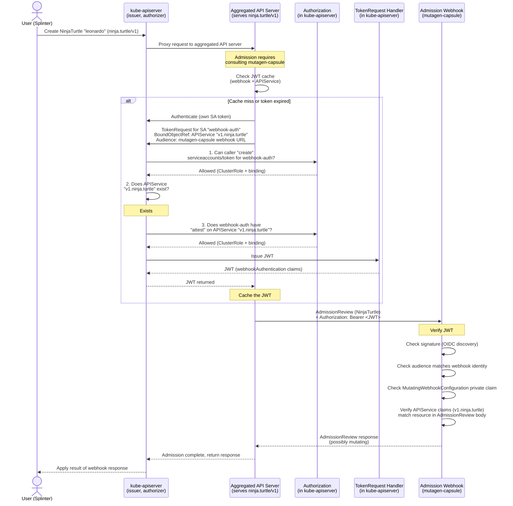
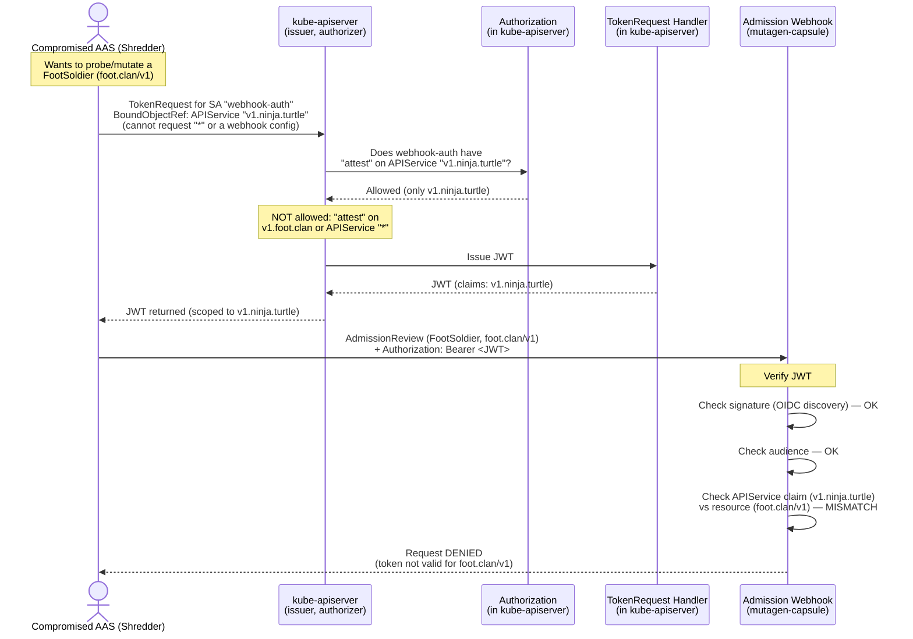

# KEP-6060: API Server Authentication to Admission Webhooks

<!-- toc -->
- [Release Signoff Checklist](#release-signoff-checklist)
- [Summary](#summary)
- [Motivation](#motivation)
  - [Goals](#goals)
  - [Non-Goals](#non-goals)
- [Proposal](#proposal)
  - [Webhook Authentication Tokens](#webhook-authentication-tokens)
  - [Token Acquisition](#token-acquisition)
    - [Kube-apiserver](#kube-apiserver)
    - [Aggregated API Servers](#aggregated-api-servers)
  - [Authorization Checks](#authorization-checks)
  - [Audience](#audience)
  - [Token Caching and Rotation](#token-caching-and-rotation)
  - [Webhook Verification](#webhook-verification)
  - [User Stories](#user-stories)
    - [Story 1: Kube-apiserver authenticates to an admission webhook](#story-1-kube-apiserver-authenticates-to-an-admission-webhook)
    - [Story 2: Aggregated API server authenticates to an admission webhook](#story-2-aggregated-api-server-authenticates-to-an-admission-webhook)
  - [Risks and Mitigations](#risks-and-mitigations)
    - [Token replay across webhooks](#token-replay-across-webhooks)
    - [Token replay across API groups](#token-replay-across-api-groups)
    - [Service account compromise](#service-account-compromise)
    - [Increased authorization load](#increased-authorization-load)
- [Design Details](#design-details)
  - [New Private Claims](#new-private-claims)
  - [BoundObjectRef for APIService](#boundobjectref-for-apiservice)
  - [RBAC Configuration](#rbac-configuration)
  - [Sequence Diagrams](#sequence-diagrams)
    - [Flow 1: Kube-apiserver authenticates to an admission webhook](#flow-1-kube-apiserver-authenticates-to-an-admission-webhook)
    - [Flow 2: Aggregated API server authenticates to an admission webhook](#flow-2-aggregated-api-server-authenticates-to-an-admission-webhook)
    - [Flow 3: A webhook denies an out-of-scope request (the APIService binding saves the day)](#flow-3-a-webhook-denies-an-out-of-scope-request-the-apiservice-binding-saves-the-day)
  - [Kube-apiserver Service Account Lifecycle](#kube-apiserver-service-account-lifecycle)
  - [Test Plan](#test-plan)
      - [Prerequisite testing updates](#prerequisite-testing-updates)
      - [Unit tests](#unit-tests)
      - [Integration tests](#integration-tests)
      - [e2e tests](#e2e-tests)
  - [Graduation Criteria](#graduation-criteria)
    - [Alpha](#alpha)
    - [Beta](#beta)
    - [GA](#ga)
  - [Upgrade / Downgrade Strategy](#upgrade--downgrade-strategy)
  - [Version Skew Strategy](#version-skew-strategy)
- [Production Readiness Review Questionnaire](#production-readiness-review-questionnaire)
  - [Feature Enablement and Rollback](#feature-enablement-and-rollback)
  - [Rollout, Upgrade and Rollback Planning](#rollout-upgrade-and-rollback-planning)
  - [Monitoring Requirements](#monitoring-requirements)
  - [Dependencies](#dependencies)
  - [Scalability](#scalability)
  - [Troubleshooting](#troubleshooting)
- [Implementation History](#implementation-history)
- [Drawbacks](#drawbacks)
- [Alternatives](#alternatives)
  - [Client Certificates (mTLS)](#client-certificates-mtls)
  - [Designated ServiceAccount (&quot;Magic SA&quot;)](#designated-serviceaccount-magic-sa)
  - [ServiceAccount Token with Identity in Private Claims](#serviceaccount-token-with-identity-in-private-claims)
  - [AdmissionReview Delegation](#admissionreview-delegation)
<!-- /toc -->

## Release Signoff Checklist

Items marked with (R) are required *prior to targeting to a milestone / release*.

- [x] (R) Enhancement issue in release milestone, which links to KEP dir in [kubernetes/enhancements] (not the initial KEP PR)
- [ ] (R) KEP approvers have approved the KEP status as `implementable`
- [ ] (R) Design details are appropriately documented
- [ ] (R) Test plan is in place, giving consideration to SIG Architecture and SIG Testing input (including test refactors)
  - [ ] e2e Tests for all Beta API Operations (endpoints)
  - [ ] (R) Ensure GA e2e tests meet requirements for [Conformance Tests](https://github.com/kubernetes/community/blob/master/contributors/devel/sig-architecture/conformance-tests.md)
  - [ ] (R) Minimum Two Week Window for GA e2e tests to prove flake free
- [ ] (R) Graduation criteria is in place
  - [ ] (R) [all GA Endpoints](https://github.com/kubernetes/community/pull/1806) must be hit by [Conformance Tests](https://github.com/kubernetes/community/blob/master/contributors/devel/sig-architecture/conformance-tests.md) within one minor version of promotion to GA
- [ ] (R) Production readiness review completed
- [ ] (R) Production readiness review approved
- [ ] "Implementation History" section is up-to-date for milestone
- [ ] User-facing documentation has been created in [kubernetes/website], for publication to [kubernetes.io]
- [ ] Supporting documentation---e.g., additional design documents, links to mailing list discussions/SIG meetings, relevant PRs/issues, release notes

[kubernetes.io]: https://kubernetes.io/
[kubernetes/enhancements]: https://git.k8s.io/enhancements
[kubernetes/kubernetes]: https://git.k8s.io/kubernetes
[kubernetes/website]: https://git.k8s.io/website

## Summary

Today, the kube-apiserver does not authenticate itself to admission webhooks
by default. Any entity with service network access can send requests to a webhook
endpoint and impersonate the kube-apiserver.
[CVE-2025-1974](https://nvd.nist.gov/vuln/detail/CVE-2025-1974) demonstrated
real-world consequences of this class of vulnerability.

This KEP introduces Webhook Authentication Tokens (WATs): short-lived,
audience-scoped JWTs that API servers present to admission webhooks as bearer
tokens. WATs are service account tokens with additional private claims
identifying the APIService whose resources are being admitted. Both the
kube-apiserver and aggregated API servers use the same mechanism to obtain
and present WATs. Webhooks verify the token signature via the existing OIDC
discovery endpoint and confirm that the token's claims match the resource
being admitted.

## Motivation

Any entity with service network access can send requests to an admission webhook
endpoint. If the webhook does not authenticate the caller, an attacker can
probe for policy information, trigger unintended side effects, or exploit
the webhook's own privileges within the cluster.

Opt-in mechanisms for authenticating the kube-apiserver to webhooks exist
(client certs, bearer tokens, or basic auth via a kubeconfig file configured
through `--admission-control-config-file`), but they require manual credential
management and an API server restart to change. In practice, this means that
when the actor setting up the API Server (or aggregated API server) and the
actor setting up the webhook are not the same, no authentication is used.

### Goals

* The kube-apiserver authenticates itself to admission webhooks by default,
  without requiring manual credential configuration.
* Aggregated API servers can authenticate themselves to admission webhooks
  using the same mechanism.
* Tokens are scoped per-webhook (by audience) and per-API-group/version
  (by bound APIService), preventing misuse of a token obtained for one webhook
  or one set of resources against another.
* The design is backward compatible: existing kubeconfig-based webhook
  authentication setups continue to work without modification.
* Defining the exact webhook-side verification go library.
* Webhook authors can verify the kube-apiserver's identity with minimal code
  changes, using existing OIDC token verification libraries.

### Non-Goals

* Authentication to non-admission webhooks (authentication webhooks,
  authorization webhooks). These use a different configuration mechanism
  (CLI flags with kubeconfig files) and are out of scope for this KEP.
* Changes to the APIService API. No new fields are added to the APIService
  spec.

## Proposal

### Webhook Authentication Tokens

A Webhook Authentication Token (WAT) is a service account token (JWT) with
additional private claims. It is produced by the existing `TokenRequest` API
(`create serviceaccounts/token`) with a new type of bound object reference:
an `APIService`. The token's `kubernetes.io` private claims include the name
and UID of the bound APIService, which encodes the API group and version of
the resources the caller is authorized to consult the webhook about.

### Token Acquisition

#### Kube-apiserver

When the kube-apiserver needs to call an admission webhook for a resource it
serves directly (e.g., a Pod, which belongs to APIService `v1.`), it issues
a `TokenRequest` to itself for a dedicated service account. The request
includes:

1. A `BoundObjectRef` pointing to the APIService corresponding to the resource
   being admitted (e.g., `v1.` for core API resources).
2. An audience derived from the webhook's URL.

A controller running in the kube-apiserver process ensures the dedicated
service account is recreated if deleted.

<<[UNRESOLVED]>>
The kube-apiserver needs `attest` permission on the APIService for the SA
it uses. Since the kube-apiserver is both the requester and the authorizer,
the self-authorization mechanism for this check needs further discussion
with SIG Auth leads.
<<[/UNRESOLVED]>>

#### Aggregated API Servers

When an aggregated API server needs to call an admission webhook, it requests
a WAT from the kube-apiserver. Each aggregated API server should have a
dedicated service account for this purpose. The request flow is:

1. The aggregated API server authenticates to the kube-apiserver using
   whatever credential it is configured with (typically its own service
   account token).
2. It sends a `TokenRequest` for its dedicated service account, with a
   `BoundObjectRef` pointing to the APIService it serves (e.g.,
   `v1.engelbert.dev`) and the appropriate audience.
3. The kube-apiserver performs authorization checks (see below) and issues
   the WAT.
4. The aggregated API server presents the WAT to the webhook as
   `Authorization: Bearer <token>`.

We expect each aggregated API server to have its own dedicated service
account for obtaining WATs. Reuse of these service accounts across
aggregated API servers is discouraged.

### Authorization Checks

When the kube-apiserver receives a `TokenRequest` with an APIService as the
`BoundObjectRef`, it performs the following checks:

1. **Standard RBAC check:** Does the caller have `create` on
   `serviceaccounts/token` for the service account named in the request?
2. **APIService existence check:** Does the referenced APIService object
   actually exist?
3. **Attest check:** Does the service account named in the request have
   `attest` permission on the referenced APIService? This is verified via a
   SubjectAccessReview-style check (an in-process `authorizer.Authorize()`
   call) against the service account's identity.

The `attest` verb is already used in Kubernetes for ClusterTrustBundle
signer attestation. The RBAC rule for the attest check looks like:

```yaml
apiVersion: rbac.authorization.k8s.io/v1
kind: ClusterRole
metadata:
  name: webhook-auth-attest
rules:
- apiGroups:
  - apiregistration.k8s.io
  resources:
  - apiservices
  resourceNames:
  - v1.engelbert.dev
  verbs:
  - attest
```

### Audience

The token's audience is derived from the webhook's URL with a fixed prefix.
For a webhook at `https://my-webhook.my-namespace.svc:443/validate`, the
audience would be:

```
k8s.io:admission:https://my-webhook.my-namespace.svc:443/validate
```

The webhook verifies that the token's `aud` claim matches its own identity
before accepting the request.

### Token Caching and Rotation

WATs are cached per combination of webhook and APIService. When a cached
token has expired, the next webhook call for that combination triggers a
new `TokenRequest`. Tokens should be short-lived; users can set
`expirationSeconds` according to their needs.

### Webhook Verification

A webhook receiving a request with a WAT performs the following checks:

1. **Verify the JWT signature** using the kube-apiserver's OIDC discovery
   endpoint (`/.well-known/openid-configuration` and `/openid/v1/jwks`).
2. **Verify the audience** matches the webhook's own identity.
3. **Verify the APIService claim** in the token's private claims. The API
   group and version encoded in the APIService name must match the group
   and version of the resource described in the AdmissionReview request body.
   If they do not match, the webhook should reject the request, because the
   token only authorizes the caller to consult the webhook about resources in
   the API group and version named in the token.

### User Stories

#### Story 1: Kube-apiserver authenticates to an admission webhook

A user creates a Pod. The kube-apiserver needs to consult a validating
admission webhook. It requests a WAT from itself for its dedicated service
account, bound to APIService `v1.` with an audience derived from the
webhook's URL. The webhook verifies the token and confirms that the API
group and version in the claims match those of the Pod resource in the
AdmissionReview body.

#### Story 2: Aggregated API server authenticates to an admission webhook

A user creates a Widget resource (`engelbert.dev/v1`). The aggregated API
server serving `engelbert.dev/v1` needs to consult a mutating admission
webhook. It requests a WAT from the kube-apiserver for its dedicated
service account, bound to APIService `v1.engelbert.dev` with the
webhook-derived audience. The kube-apiserver verifies that the caller can
create tokens for the SA, that the APIService exists, and that the SA
has `attest` permission on `v1.engelbert.dev`. The aggregated API server
presents the WAT to the webhook. The webhook verifies the token signature,
audience, and confirms the claims match the Widget resource.

### Risks and Mitigations

#### Token replay across webhooks

A WAT obtained for one webhook could be presented to another webhook if
they serve overlapping resources. The per-webhook audience scoping prevents
this: each token is only valid for the specific webhook audience it was
minted for.

#### Token replay across API groups

A WAT bound to one APIService could be presented when admitting a resource
from a different API group. The webhook's verification of the APIService
claims against the AdmissionReview body prevents this: the group and version
must match.

#### Service account compromise

If a WAT service account is compromised, an attacker could request WATs and
impersonate the API server to webhooks. The dedicated-SA-per-server model
limits the blast radius. The `attest` check ensures that even with token
creation permission, the SA must be explicitly authorized for the specific
APIService.

#### Increased authorization load

Each WAT request triggers an additional authorization check (the `attest`
verification). This is mitigated by caching: WATs are cached for their
lifetime, so the authorization check is amortized over many webhook calls.

## Design Details

### New Private Claims

WATs include the following new fields in the `kubernetes.io` private claims
of the JWT:

```json
{
  "kubernetes.io": {
    "webhookAuthentication": {
      "apiService": {
        "name": "v1.engelbert.dev",
        "uid": "44e818f2-2ad0-4432-9816-3a649ca9945c"
      }
    }
  }
}
```

The `name` field encodes the API version and group in the standard
`<version>.<group>` format. The `uid` field is the UID of the APIService
object at the time the token was issued.

### BoundObjectRef for APIService

The `TokenRequest` API's `BoundObjectRef` is extended to accept `APIService`
as a valid object reference kind. This follows the existing pattern for
binding tokens to Pods, Nodes, and Secrets. The token becomes invalid if
the referenced APIService is deleted.

### RBAC Configuration

For an aggregated API server serving `engelbert.dev/v1`, the following
RBAC configuration is needed:

1. A dedicated service account (e.g., `webhook-auth` in the aggregated
   API server's namespace).

2. The aggregated API server's principal needs `create` on
   `serviceaccounts/token` for the dedicated SA:

```yaml
apiVersion: rbac.authorization.k8s.io/v1
kind: ClusterRole
metadata:
  name: engelbert-webhook-token-creator
rules:
- apiGroups: [""]
  resources: ["serviceaccounts/token"]
  resourceNames: ["webhook-auth"]
  verbs: ["create"]
```

3. The dedicated SA needs `attest` on the APIService:

```yaml
apiVersion: rbac.authorization.k8s.io/v1
kind: ClusterRole
metadata:
  name: engelbert-webhook-attest
rules:
- apiGroups: ["apiregistration.k8s.io"]
  resources: ["apiservices"]
  resourceNames: ["v1.engelbert.dev"]
  verbs: ["attest"]
```

### Sequence Diagrams

The following diagrams illustrate the two primary flows for WAT issuance
and webhook authentication.

#### Flow 1: Kube-apiserver authenticates to an admission webhook

1. A user named Splinter will attempt to create a `deployment` named ninja-turtles on the cluster.
2. In this flow, `kube-apiserver` is both the token requester, token issuer, and the
   webhook caller.
3. The webhook is named `mutagen-capsule`.
4. The Service Account for the `kube-apiserver` is named `kube-system:webhook-auth`.
5. It requests a JWT from itself for this dedicated service account.
6. The request is for a token that is valid for the webhook rather than a particular
   APIService.
7. This is accomplished by requesting a token that is bound to the
   MutatingWebhookConfiguration for the `mutagen-capsule` webhook.
8. The kube-apiserver (as server) performs authorization checks on the dedicated
   service account and the principal requesting the token (the `kube-apiserver` as client,
   represented by its service account in this case).  The checks for the
   `kube-system:webhook-auth` service account are:
   1. The ability to create tokens for the `kube-system:webhook-auth` service account.
   2. The `kube-apiserver` verifies that the MutatingWebhookConfiguration exists.
   3. The `attest` permission on the `APIService` `"*"`.  This means that it can ask
      any webhook any question about any object.  This is the out-of-the-box default permission
      for the kube-apiserver service account. However, the `audience` on this token will be
      set to this `mutagen-capsule` webhook.
9. The `kube-apiserver` will authenticate itself to the webhook.
10. The `kube-apiserver` will interrogate the webhook on behalf of the user.
11. The webhook will give the `kube-apiserver` the appropriate response regarding the
    user's Deployment creation, potentially mutating the request.
12. The `kube-apiserver` will then take the appropriate action based on the mutating
    webhook's response.


#### Flow 2: Aggregated API server authenticates to an admission webhook

1. A user named Splinter will attempt to create a `NinjaTurtle` named `leonardo`
   on the cluster. `NinjaTurtle` belongs to the `ninja.turtle/v1` API, which is
   served by an aggregated API server rather than directly by the `kube-apiserver`.
2. Unlike Flow 1, where the `kube-apiserver` played every role, this flow has two
   server processes:
   - the `kube-apiserver`, which is the token issuer and the authorizer, and
   - a separate `aggregated API server`, which is the token requester and the
     webhook caller.
3. The webhook is named `mutagen-capsule`.
4. The aggregated API server has its own dedicated Service Account named
   `webhook-auth` (in the aggregated API server's namespace). Reuse of this
   service account across aggregated API servers is discouraged.
5. When Splinter creates the `NinjaTurtle`, the `kube-apiserver` proxies the request
   to the aggregated API server that serves `ninja.turtle/v1`.
6. The aggregated API server determines that admission requires consulting the
   `mutagen-capsule` webhook, and so it needs a JWT in order to authenticate.
7. The aggregated API server authenticates to the `kube-apiserver` (typically with
   its own service account token) and requests a JWT for its dedicated
   `webhook-auth` service account. The request is for a token that is:
   - bound to the `APIService` `v1.ninja.turtle` (via a `BoundObjectRef`), scoping
     the token to the group/version the aggregated API server serves, and
   - scoped to the `mutagen-capsule` webhook via the `audience`.
8. The `kube-apiserver` (as server) performs authorization checks on the dedicated
   service account and the principal requesting the token (the aggregated API
   server as client). The checks for the `webhook-auth` service account are:
   1. The ability of the caller to create tokens for the `webhook-auth` service
      account.
   2. That the referenced `APIService` `v1.ninja.turtle` actually exists.
   3. The `attest` permission for the `webhook-auth` service account on the
      `APIService` `v1.ninja.turtle`. Unlike the `kube-apiserver` in Flow 1 (which
      holds `attest` on `"*"`), the aggregated API server is granted `attest` only
      on the specific APIService it serves, via an explicit ClusterRole and
      binding.
9. The `kube-apiserver` issues the JWT (carrying the `webhookAuthentication`
   claims for `v1.ninja.turtle`) and returns it to the aggregated API server,
   which caches it per webhook + APIService.
10. The aggregated API server authenticates itself to the `mutagen-capsule` webhook
    by presenting the JWT as a bearer token, and interrogates the webhook on behalf
    of Splinter.
11. The webhook verifies the JWT signature (via OIDC discovery), that the audience
    matches its own identity, and that the APIService claims (`v1.ninja.turtle`)
    match the `NinjaTurtle` resource in the AdmissionReview body.
12. The webhook returns the appropriate response (potentially mutating `leonardo`),
    the aggregated API server applies it and returns the result to the
    `kube-apiserver`, which returns the final response to Splinter.



#### Flow 3: A webhook denies an out-of-scope request (the APIService binding saves the day)

This flow illustrates *why* aggregated API servers bind their tokens to an
`APIService` rather than to a webhook configuration, and how that choice causes
an out-of-scope request to be denied.

1. Recall that a WAT can be bound (via its `BoundObjectRef`) to either of two
   kinds of object:
   - a `MutatingWebhookConfiguration` / `ValidatingWebhookConfiguration`, which
     scopes the token to a *webhook* (it may ask that webhook about *any* object),
     or
   - an `APIService`, which scopes the token to a single *API group/version* (it
     may only ask about resources in that group/version).
2. The trusted `kube-apiserver` binds to the webhook configurations (as in Flow 1,
   where it holds `attest` on `APIService` `"*"`). It is the control plane, so it
   is trusted to ask any webhook about any object.
3. Aggregated API servers are *not* granted that broad privilege. By the principle
   of least privilege, each aggregated API server is only allowed to obtain the
   *most restricted* token: one bound to the single `APIService` it serves. We do
   not necessarily trust an aggregated API server with broad permissions, so it is
   never granted `attest` on a webhook configuration or on `APIService` `"*"`.
4. In this flow, the aggregated API server serving `ninja.turtle/v1` has been
   compromised (or is simply buggy) and the attacker is `shredder`. Shredder wants
   to abuse the `mutagen-capsule` webhook to probe or mutate a resource that the
   aggregated API server has no authority over — a `FootSoldier` in the
   `foot.clan/v1` API.
5. The aggregated API server can only obtain a WAT bound to its own `APIService`
   `v1.ninja.turtle` (the kube-apiserver will not issue it anything broader,
   because it lacks `attest` on `v1.foot.clan` and on `"*"`).
6. Shredder presents that `v1.ninja.turtle`-bound token to the `mutagen-capsule`
   webhook, but in an `AdmissionReview` describing a `FootSoldier` (`foot.clan/v1`)
   rather than a `NinjaTurtle`.
7. The webhook performs its normal verification: the JWT signature is valid and
   the audience matches. But when it compares the token's APIService claim
   (`v1.ninja.turtle`) against the resource in the `AdmissionReview` body
   (`foot.clan/v1`), they do **not** match.
8. The webhook denies the request. The APIService binding is what saves the day:
   even with a validly signed, correctly-audienced token, the aggregated API
   server cannot use it to consult the webhook about resources outside the API
   group/version it is authorized for.



### Kube-apiserver Service Account Lifecycle

The kube-apiserver uses a dedicated service account for requesting its own
WATs. A controller running in the kube-apiserver process (following the
`ClusterAuthenticationTrustController` pattern) ensures this service account
is recreated if deleted.

### Test Plan

[x] I/we understand the owners of the involved components may require updates
to existing tests to make this code solid enough prior to committing the
changes necessary to implement this enhancement.

##### Prerequisite testing updates

None identified at this time.

##### Unit tests

- `k8s.io/apiserver/pkg/admission/plugin/webhook`: `<date>` - `<coverage>`
- `k8s.io/apiserver/pkg/util/webhook`: `<date>` - `<coverage>`
- `k8s.io/apiserver/pkg/registry/serviceaccount/token`: `<date>` - `<coverage>`

Unit tests will cover:
- TokenRequest with APIService BoundObjectRef issues correct private claims.
- The `attest` authorization check is performed and enforced.
- The webhook dispatch path attaches the WAT as a bearer token when the
  feature gate is enabled.
- The webhook dispatch path does not attach a token when the feature gate
  is disabled.

##### Integration tests

- WAT issuance and webhook dispatch end-to-end with a test webhook that
  verifies token claims.
- Rejection when the SA lacks `attest` permission.
- Rejection when the referenced APIService does not exist.
- Cache behavior: verify that a cached token is reused and that a new token
  is requested on expiry.
- Feature gate toggling: verify behavior with the gate on and off.

##### e2e tests

- An aggregated API server authenticates to an admission webhook using a
  WAT.
- A webhook rejects a request where the APIService claims do not match the
  resource in the AdmissionReview body.

### Graduation Criteria

#### Alpha

- Feature implemented behind feature gates.
- Initial unit and integration tests completed and enabled.
- WAT issuance and webhook presentation functional for kube-apiserver.

#### Beta

- WAT issuance and webhook presentation functional for aggregated API
  servers.
- All unit, integration, and e2e tests passing and stable.
- Feedback from early adopters incorporated.
- All known issues and gaps resolved.

#### GA

- At least two releases since beta with no regressions.
- Conformance tests added.
- Webhook verification library or documentation available.

### Upgrade / Downgrade Strategy

On upgrade to a version that enables the feature:
- The kube-apiserver begins presenting WATs to admission webhooks. Webhooks
  that do not verify bearer tokens are unaffected, since the token is
  presented as an `Authorization` header that the webhook can ignore.
- Existing kubeconfig-based authentication setups continue to function.

On downgrade or feature disablement:
- The kube-apiserver stops presenting WATs. Webhooks that have been
  configured to require WAT verification will reject requests. Operators
  must either re-enable the feature or reconfigure their webhooks.

### Version Skew Strategy

This feature does not involve coordination between the control plane and
nodes. It is contained entirely within the kube-apiserver and aggregated
API servers.

In a multi-replica HA cluster during rolling upgrade, some kube-apiserver
replicas may present WATs while others do not. Webhooks that require WAT
verification may see intermittent failures during the rollout window.
Webhooks should be configured to require WATs only after all replicas have
been upgraded.

## Production Readiness Review Questionnaire

### Feature Enablement and Rollback

###### How can this feature be enabled / disabled in a live cluster?

- [x] Feature gate (also fill in values in `kep.yaml`)
  - Feature gate name: `APIServerWebhookAuthenticationTokenIssuance`
  - Components depending on the feature gate:
    - kube-apiserver
- [x] Feature gate (also fill in values in `kep.yaml`)
  - Feature gate name: `APIServerWebhookAuthenticationTokenVerification`
  - Components depending on the feature gate:
    - kube-apiserver

###### Does enabling the feature change any default behavior?

Yes. When the issuance feature gate is enabled, the kube-apiserver will
request a service account token (from itself) bound to the appropriate
APIService for the resource in question and present it to the webhook as a
bearer token. Webhooks that do not inspect the `Authorization` header will
be unaffected. Webhooks configured to accept bearer tokens of a different
format may error upon receipt of this token.

This KEP is scoped to admission webhooks only. Other webhook types are out
of scope.

###### Can the feature be disabled once it has been enabled (i.e. can we roll back the enablement)?

Yes. Disabling `APIServerWebhookAuthenticationTokenIssuance` and restarting
the kube-apiserver will revert to the previous behavior. Webhooks that have
been configured to require the WAT will begin rejecting requests, since the
API server will no longer present a token.

###### What happens if we reenable the feature if it was previously rolled back?

The feature will resume working as expected. No data migration or cleanup
is required.

###### Are there any tests for feature enablement/disablement?

Unit tests will verify that when the feature gate is enabled, the webhook
dispatch path presents a WAT. When the feature gate is disabled, no token
is presented. Integration tests will exercise the full webhook call path
with the feature gate toggled on and off.

### Rollout, Upgrade and Rollback Planning

###### How can a rollout or rollback fail? Can it impact already running workloads?

During rollout in a multi-replica HA cluster, some replicas may present WATs
while others do not. Webhooks that require WATs may see intermittent failures
from replicas that have not yet been upgraded. This does not affect already
running workloads directly, but it affects admission of new or modified objects
during the rollout window.

On rollback, webhooks that were configured to require WATs will reject all
requests. Operators should reconfigure webhooks before or immediately after
rollback.

###### What specific metrics should inform a rollback?

An increase in `apiserver_admission_webhook_rejection_count` with rejection
codes indicating authentication failure (401, 403) after enabling the feature
would indicate a problem. An increase in
`apiserver_admission_webhook_fail_open_count` would indicate that webhooks are
failing and the fail-open policy is being invoked more frequently than
expected.

###### Were upgrade and rollback tested? Was the upgrade->downgrade->upgrade path tested?

Integration tests will cover feature gate enablement and disablement. Manual
testing of the upgrade->downgrade->upgrade path will be performed before
beta promotion.

###### Is the rollout accompanied by any deprecations and/or removals of features, APIs, fields of API types, flags, etc.?

No. The existing kubeconfig-based webhook authentication mechanism is not
deprecated.

### Monitoring Requirements

###### How can an operator determine if the feature is in use by workloads?

The feature is not workload-facing. It is a control plane behavior. An
operator can determine the feature is active by checking the kube-apiserver
feature gate configuration and by observing WAT-related metrics (see below).

###### How can someone using this feature know that it is working for their instance?

- [x] Other (treat as last resort)
  - Details: A webhook operator can verify the feature is working by checking
    the `Authorization` header on incoming requests for a valid JWT with the
    expected audience and APIService claims. The kube-apiserver metrics below
    confirm that tokens are being issued and presented.

###### What are the reasonable SLOs (Service Level Objectives) for the enhancement?

Use of this feature should not change existing API SLOs. The additional
latency from WAT issuance is amortized by caching.

###### What are the SLIs (Service Level Indicators) an operator can use to determine the health of the service?

- [x] Metrics
  - Metric name: `apiserver_admission_webhook_latency_seconds` (existing)
  - Aggregation method: 99th percentile
  - Components exposing the metric: kube-apiserver
- [x] Metrics
  - Metric name: `apiserver_admission_webhook_rejection_count` (existing)
  - Components exposing the metric: kube-apiserver

###### Are there any missing metrics that would be useful to have to improve observability of this feature?

New metrics to add:
- `apiserver_webhook_authentication_token_request_total`: counter of WAT
  requests, labeled by success/failure.
- `apiserver_webhook_authentication_token_request_duration_seconds`:
  histogram of WAT request latency.
- `apiserver_webhook_authentication_token_cache_hit_total`: counter of
  cache hits when looking up cached WATs.

### Dependencies

###### Does this feature depend on any specific services running in the cluster?

No new dependencies. The feature uses the existing `TokenRequest` API and
OIDC discovery endpoint, both of which are part of the kube-apiserver.

### Scalability

###### Will enabling / using this feature result in any new API calls?

Yes. The kube-apiserver will make a `TokenRequest` API call
(`create serviceaccounts/token`) prior to calling a webhook, when no valid
cached token exists. Each request with an APIService `BoundObjectRef`
triggers an additional authorization check (the `attest` verification). The
APIService object is also fetched to verify it exists.

Aggregated API servers will make the same calls to the kube-apiserver.

This additional load is mitigated by caching WATs for their lifetime. Once
a token is cached for a given webhook+APIService combination, no new API
calls are needed until the token expires.

###### Will enabling / using this feature result in introducing new API types?

No. However, the `attest` verb is introduced for use on `apiservices`
resources.

###### Will enabling / using this feature result in any new calls to the cloud provider?

If service account token signing has been offloaded to an external signer,
there will be an increase in signing requests proportional to the number
of unique webhook+APIService combinations.

###### Will enabling / using this feature result in increasing size or count of the existing API objects?

Yes. Each aggregated API server will have a dedicated service account for
WAT requests. The kube-apiserver will have an additional service account
for the same purpose. Additional RBAC roles and bindings will be needed.

The JWT itself gains a new field in its private claims (`webhookAuthentication`)
but this is not stored in etcd.

###### Will enabling / using this feature result in increasing time taken by any operations covered by existing SLIs/SLOs?

On the first webhook call for a given webhook+APIService combination, there
will be additional latency from the `TokenRequest` and authorization check.
Subsequent calls use the cached token and incur no additional latency. The
cost is amortized over the token's lifetime.

###### Will enabling / using this feature result in non-negligible increase of resource usage (CPU, RAM, disk, IO, ...) in any components?

Minimal increase in memory for the WAT cache (one JWT per
webhook+APIService combination). CPU impact from token signing is negligible
and amortized by caching.

###### Can enabling / using this feature result in resource exhaustion of some node resources (PIDs, sockets, inodes, etc.)?

No. This feature does not affect nodes.

### Troubleshooting

###### How does this feature react if the API server and/or etcd is unavailable?

If the kube-apiserver is unavailable, no webhook calls are made and the
feature is moot. If etcd is unavailable, the dedicated service account and
APIService objects cannot be read, and WAT issuance will fail. Webhook
calls will proceed without a WAT (or fail, depending on the webhook's
configuration).

###### What are other known failure modes?

- WAT service account is deleted
  - Detection: `apiserver_webhook_authentication_token_request_total` with
    failure label increases.
  - Mitigations: The in-process controller will recreate the service account
    (for the kube-apiserver's own SA). For aggregated API servers, the
    operator must recreate the SA.
  - Diagnostics: kube-apiserver logs will show token request failures.
  - Testing: Integration tests cover SA deletion and recreation.

- WAT SA lacks `attest` permission
  - Detection: `apiserver_webhook_authentication_token_request_total` with
    failure label increases. Webhook calls proceed without authentication
    or fail, depending on webhook configuration.
  - Mitigations: Grant the `attest` permission via RBAC.
  - Diagnostics: kube-apiserver logs will show authorization denial for
    the `attest` check.
  - Testing: Integration tests cover missing `attest` permission.

- Webhook rejects WAT due to claims mismatch
  - Detection: `apiserver_admission_webhook_rejection_count` increases.
  - Mitigations: Verify that the webhook is correctly matching the
    APIService claims against the resource in the AdmissionReview body.
  - Diagnostics: Webhook server logs will show the specific claim mismatch.
  - Testing: e2e tests cover claims mismatch rejection.

###### What steps should be taken if SLOs are not being met to determine the problem?

1. Check `apiserver_webhook_authentication_token_request_total` for WAT
   request failures.
2. Check `apiserver_admission_webhook_rejection_count` for webhook
   rejections.
3. Check `apiserver_admission_webhook_latency_seconds` for increased
   latency.
4. Verify the dedicated SA exists and has the correct RBAC permissions.
5. If the problem cannot be resolved, disable the
   `APIServerWebhookAuthenticationTokenIssuance` feature gate and restart
   the kube-apiserver.

## Implementation History

## Drawbacks

- Additional authorization checks on each WAT request add some overhead,
  though this is mitigated by caching.
- Webhook authors need to implement token verification to benefit from the
  feature, though a verification library will be provided.
- The feature introduces a new use of the `attest` verb and extends the
  `BoundObjectRef` to support APIService, adding surface area to the
  TokenRequest API.

## Alternatives

### Client Certificates (mTLS)

The kube-apiserver could authenticate to webhooks using client certificates
(e.g., the existing front-proxy cert). This was considered but has drawbacks:
L7 proxies terminate TLS and strip client certs, making this unreliable in
common deployment topologies (service meshes, cloud load balancers, ingress
controllers). Bearer tokens survive L7 proxies because they are HTTP headers.

### Designated ServiceAccount ("Magic SA")

A well-known service account name could represent the API server's identity.
This was considered but rejected because it expands the semantic meaning of
ServiceAccount from "workload identity" to "control-plane identity" and
relies on a magic name convention rather than explicit authorization.

### ServiceAccount Token with Identity in Private Claims

Any service account token could carry a special claim indicating API server
identity, gated by a synthetic subresource authorization check. This was
considered but rejected in favor of binding to the APIService object, which
provides a more semantically precise identity (the caller is authorized for
a specific API group/version, not just "is an API server").

### AdmissionReview Delegation

Aggregated API servers could delegate admission to the kube-apiserver via a
new AdmissionReview REST API. This was considered but rejected due to its
large scope (requiring its own KEP and significant API surface) and because
it would not address the kube-apiserver's own authentication to webhooks.
