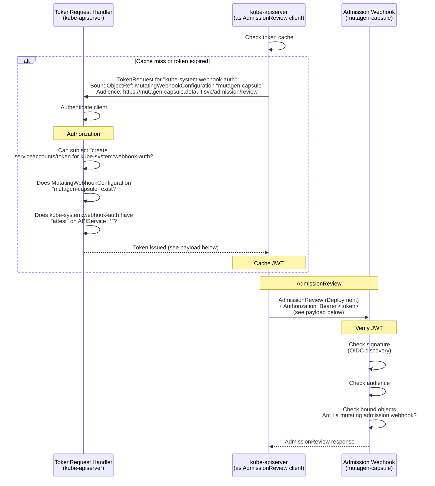
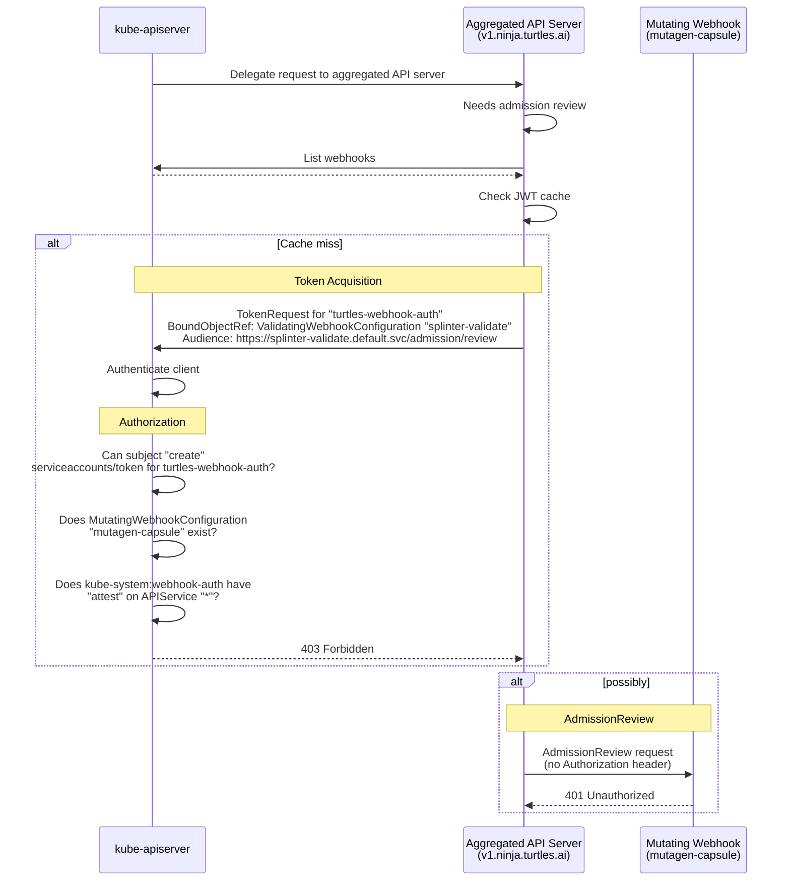
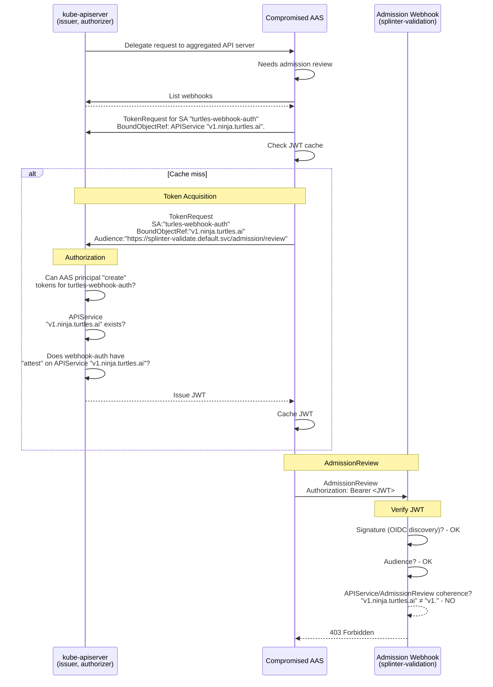
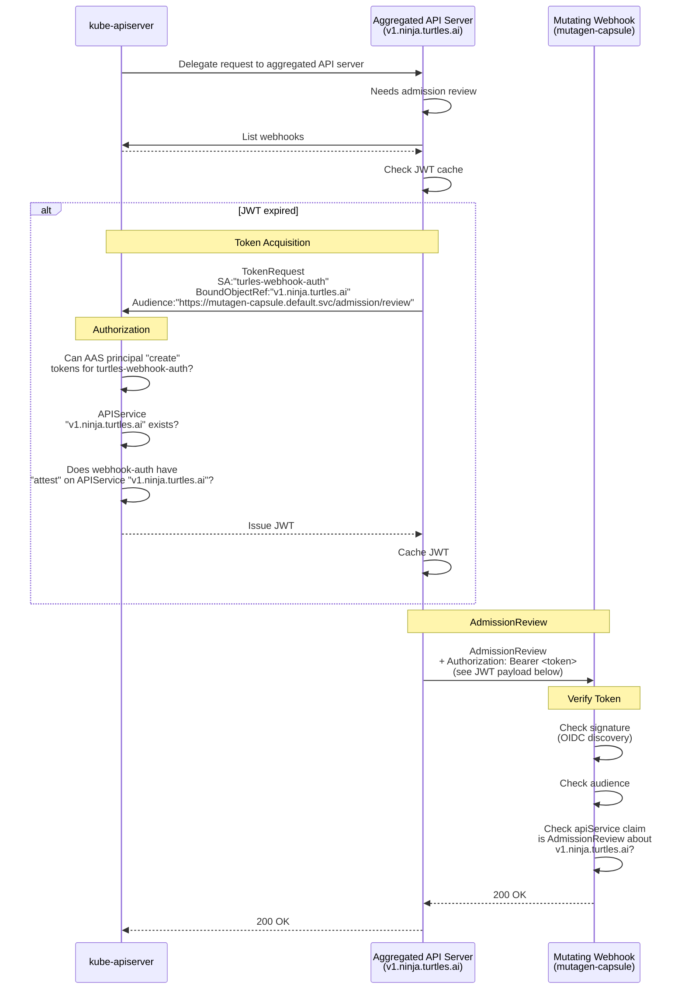
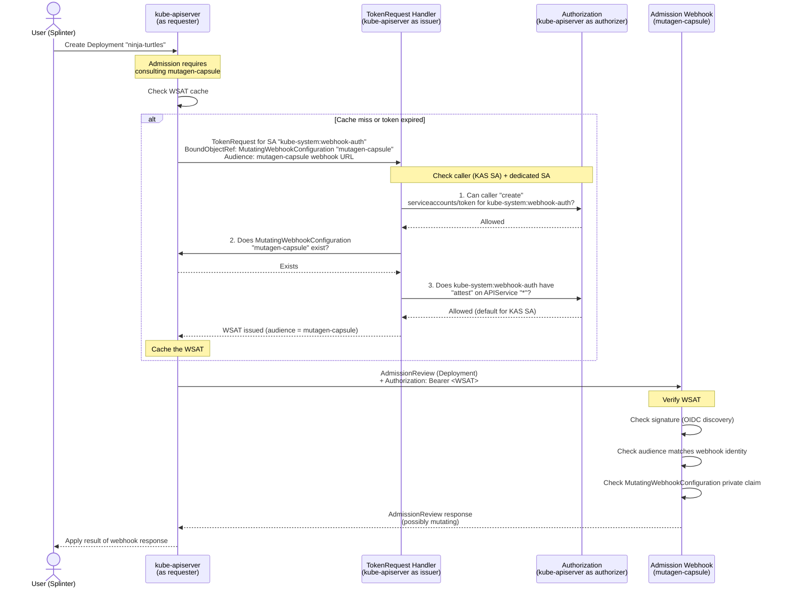

# KEP-6060: API Server Authentication to Admission Webhooks

<!-- toc -->
- [Release Signoff Checklist](#release-signoff-checklist)
- [Summary](#summary)
- [Motivation](#motivation)
  - [Goals](#goals)
  - [Non-Goals](#non-goals)
- [Terms](#terms)
  - [Token Acquisition Service Account](#token-acquisition-service-account)
  - [Webhook Authentication Client](#webhook-authentication-client)
  - [Aggregated API Servers and <code>kube-apiserver</code>](#aggregated-api-servers-and-kube-apiserver)
  - [Webhook Authentication Bound Object Types](#webhook-authentication-bound-object-types)
- [Proposal](#proposal)
  - [Token Acquisition (client perspective)](#token-acquisition-client-perspective)
    - [All webhook authentication clients:](#all-webhook-authentication-clients)
    - [<code>kube-apiserver</code>:](#kube-apiserver)
    - [Aggregated API Servers:](#aggregated-api-servers)
  - [Authorization Checks](#authorization-checks)
  - [Token Verification](#token-verification)
  - [Audience](#audience)
  - [Token Caching and Rotation](#token-caching-and-rotation)
  - [Webhook Verification](#webhook-verification)
  - [User Stories](#user-stories)
    - [Story 1: Kube-apiserver authenticates to an admission webhook](#story-1-kube-apiserver-authenticates-to-an-admission-webhook)
    - [Story 2: Aggregated API server authenticates to an admission webhook](#story-2-aggregated-api-server-authenticates-to-an-admission-webhook)
  - [Risks and Mitigations](#risks-and-mitigations)
    - [Token replay across webhooks](#token-replay-across-webhooks)
    - [Token replay across API groups](#token-replay-across-api-groups)
    - [Service account compromise](#service-account-compromise)
    - [Increased authorization load](#increased-authorization-load)
- [Design Details](#design-details)
  - [New Private Claims](#new-private-claims)
  - [BoundObjectRef for APIService](#boundobjectref-for-apiservice)
  - [RBAC Configuration](#rbac-configuration)
  - [Sequence Diagrams](#sequence-diagrams)
    - [Flow 1: Kube-apiserver authenticates to an admission webhook](#flow-1-kube-apiserver-authenticates-to-an-admission-webhook)
    - [Flow 2: Aggregated API server authenticates to an admission webhook](#flow-2-aggregated-api-server-authenticates-to-an-admission-webhook)
    - [Flow 3: A webhook denies an out-of-scope request (the APIService binding saves the day)](#flow-3-a-webhook-denies-an-out-of-scope-request-the-apiservice-binding-saves-the-day)
  - [Kube-apiserver Service Account Lifecycle](#kube-apiserver-service-account-lifecycle)
  - [Test Plan](#test-plan)
      - [Prerequisite testing updates](#prerequisite-testing-updates)
      - [Unit tests](#unit-tests)
      - [Integration tests](#integration-tests)
      - [e2e tests](#e2e-tests)
  - [Graduation Criteria](#graduation-criteria)
    - [Alpha](#alpha)
    - [Beta](#beta)
    - [GA](#ga)
  - [Upgrade / Downgrade Strategy](#upgrade--downgrade-strategy)
  - [Version Skew Strategy](#version-skew-strategy)
- [Production Readiness Review Questionnaire](#production-readiness-review-questionnaire)
  - [Feature Enablement and Rollback](#feature-enablement-and-rollback)
  - [Rollout, Upgrade and Rollback Planning](#rollout-upgrade-and-rollback-planning)
  - [Monitoring Requirements](#monitoring-requirements)
  - [Dependencies](#dependencies)
  - [Scalability](#scalability)
  - [Troubleshooting](#troubleshooting)
- [Implementation History](#implementation-history)
- [Drawbacks](#drawbacks)
- [Alternatives](#alternatives)
  - [Client Certificates (mTLS)](#client-certificates-mtls)
  - [Designated ServiceAccount (&quot;Magic SA&quot;)](#designated-serviceaccount-magic-sa)
  - [ServiceAccount Token with Identity in Private Claims](#serviceaccount-token-with-identity-in-private-claims)
  - [AdmissionReview Delegation](#admissionreview-delegation)
<!-- /toc -->

## Release Signoff Checklist

Items marked with (R) are required *prior to targeting to a milestone / release*.

- [x] (R) Enhancement issue in release milestone, which links to KEP dir in [kubernetes/enhancements] (not the initial KEP PR)
- [ ] (R) KEP approvers have approved the KEP status as `implementable`
- [ ] (R) Design details are appropriately documented
- [ ] (R) Test plan is in place, giving consideration to SIG Architecture and SIG Testing input (including test refactors)
  - [ ] e2e Tests for all Beta API Operations (endpoints)
  - [ ] (R) Ensure GA e2e tests meet requirements for [Conformance Tests](https://github.com/kubernetes/community/blob/master/contributors/devel/sig-architecture/conformance-tests.md)
  - [ ] (R) Minimum Two Week Window for GA e2e tests to prove flake free
- [ ] (R) Graduation criteria is in place
  - [ ] (R) [all GA Endpoints](https://github.com/kubernetes/community/pull/1806) must be hit by [Conformance Tests](https://github.com/kubernetes/community/blob/master/contributors/devel/sig-architecture/conformance-tests.md) within one minor version of promotion to GA
- [ ] (R) Production readiness review completed
- [ ] (R) Production readiness review approved
- [ ] "Implementation History" section is up-to-date for milestone
- [ ] User-facing documentation has been created in [kubernetes/website], for publication to [kubernetes.io]
- [ ] Supporting documentation---e.g., additional design documents, links to mailing list discussions/SIG meetings, relevant PRs/issues, release notes

[kubernetes.io]: https://kubernetes.io/
[kubernetes/enhancements]: https://git.k8s.io/enhancements
[kubernetes/kubernetes]: https://git.k8s.io/kubernetes
[kubernetes/website]: https://git.k8s.io/website

## Summary

Today, the kube-apiserver does not authenticate itself to admission webhooks
by default. Any entity with service network access can send requests to a webhook
endpoint and impersonate the kube-apiserver.
[CVE-2025-1974](https://nvd.nist.gov/vuln/detail/CVE-2025-1974) demonstrated
real-world consequences of this class of vulnerability.

The introduction of the capability to authenticate API Servers
consists of three main additions. First, [webhook authentication
clients](#webhook-authentication-client) will be updated to request a service
account token from `kube-apiserver`, and to present the credential to the
admission webhook. Second, `kube-apiserver` will be updated to dispense
those tokens to authenticated and authorized principals. Third, a token
verification library will be introduced for use by webhook maintainers.

This KEP augments the private claims of a service account token (JWT) to support
three new types of bound object, which will be included in the `TokenRequest`
made by the [webhook authentication client](#webhook-authentication-client). The
bound object may be one of `APIService`, `ValidatingWebhookConfiguration`,
or `MutatingWebhookConfiguration`.

A list of [terms](#terms) is provided below to prevent awkward sentence
constructions and for disambiguation.

## Motivation

Any entity with service network access can send requests to an admission webhook
endpoint. If the webhook does not authenticate the caller, an attacker can
probe for policy information, trigger unintended side effects, or exploit
the webhook's own privileges within the cluster.

Opt-in mechanisms for authenticating the kube-apiserver to webhooks exist
(client certs, bearer tokens, or basic auth via a kubeconfig file configured
through `--admission-control-config-file`), but they require manual credential
management and an API server restart to change. That opt-in mechanism is
unopinionated as to the method of authentication (mTLS / token / basic auth),
creating a large burden on webhook maintainers to support verification of
client identity by all three methods. More broadly, the burden is greatest
when the actor setting up the API Server (or aggregated API server) and the
actor setting up the webhook are not the same, as is usually the case with
"off-the-shelf", community OSS webhooks.

An opinionated, on-by-default solution is needed to reduce the friction
to adoption. This KEP is designed to make it possible to transition in
phases. First, [webhook authentication client](#webhook-authentication-client)
libraries are configured to use them by default (except in cases where
it would break an existing authentication setup). At this stage, webhooks
may not yet have been updated to verify the tokens. Webhooks can instead
silently ignore them. In the second phase, once credential issuance is GA and
webhook maintainers can reasonably expect a credential to be present, webhook
maintainers can use the provided library to opt-in to token verification. Over
time, we expect this to make the landscape as a whole more secure.

In addition to `kube-apiserver`, aggregated API servers often need to contact
webhooks. Yet, they should should not have broad access to ask arbitrary
questions to webhooks. A design is needed to make it easy for aggregated API
servers to query webhooks about resources it controls, but which prevents
a malicious aggregated API server from requesting policy information about
resources it does not control.

The scope of this KEP is limited to authenticating to admission webhooks.
Authentication webhooks, authorization webhooks, and audit webhooks do
not share the same practical barriers to authentication experienced by
admission webhooks. For one, those webhooks are not dynamically deployed at
runtime, and they already require a `kube-apiserver` restart to change their
configuration. Furthermore, because the actor setting up `kube-apiserver`
and the actor setting up the webhook are the same in the vast majority of
cases, it is much more reasonable to expect that such an actor would use
the already available solution: they are in control of both the method of
authentication used by the client and the verification methods used by the
webhook. This leaves a slight gap, requiring that all deployed aggregated API
servers that communicate with these webhooks must also have access to the
necessary credentials. The gap is acknowledged but considered out-of-scope
to keep the implementation practical for the most common use-cases.

### Goals

* `kube-apiserver` authenticates itself to admission webhooks by default,
  without requiring manual credential configuration.
* Aggregated API servers can authenticate themselves to admission webhooks
  using the same mechanism.
* Minimal manual setup involved, both for webhook maintainers and cluster
  administrators. The KEP authors believe firmly that friction prevents
  adoption.
* The default behavior of webhook authentication clients is to procure a
  token and provide it to webhooks.
* The design does not break webhooks that have not yet adopted token
  verification.
* `kube-apiserver` authorizes webhook authentication clients at token issuance,
  and will refuse to provide a token to unauthorized principals.
* Setting up the requisite permissions for token acquisition should be simple
  and easy.
* The token is scoped to a subset of resources about which its bearer may
  contact the webhook.
* Tokens may alternatively be scoped per-webhook (by audience).
* The design is backward compatible: existing kubeconfig-based webhook
  authentication setups continue to work without modification.
* Defining the webhook-side verification go library.

### Non-Goals

* Authentication to non-admission webhooks (authentication webhooks,
  authorization webhooks, audit webhooks).
* Requiring `kube-apiserver` to cache and refresh massive numbers of
  narrowly-scoped tokens.
* Requiring webhooks to perform `TokenReview` or `SubjectAccessReview`
  requests to `kube-apiserver`.
* Permitting aggregated API servers to have broad access to webhooks.

## Terms

### Token Acquisition Service Account
The service account named in tokens for webhook authentication will be termed
the **Token Acquisition Service Account**. This is distinct from the identity
that the principal requesting the token uses to authenticate itself to the
Kubernetes API Server (which may or may not be a service account). The Token
Acquisition Service Account must have `attest` permissions on the `APIService`
object named in the `TokenRequest` ().

### Webhook Authentication Client
Because both `kube-apiserver` and aggregated API servers will attempt
to authenticate to webhooks, the term **webhook authentication client**
will be used as a throughout this document as a generic term to refer to
both types of client when distinguishing between them is not important. The
overall flow for both `kube-apiserver` and aggregated API servers is mostly
the same, but with a few subtle differences.

### Aggregated API Servers and `kube-apiserver`
When referring specifically to the Kubernetes API Server, the
terms **`kube-apiserver`** and **Kubernetes API Server** will be used
interchangeably. When referring specifically to an **Aggregated API Server**,
the full term will always be used.

### Webhook Authentication Bound Object Types
The term **webhook authentication bound object types** will be used to refer
to the three newly-added types considered valid as a `BoundObjectRef` in a
`TokenRequest` where distinguishing between them is not important. Specifically,
the new types recognized will be `APIService`, `ValidatingWebhookConfiguration`,
and `MutatingWebhookConfiguration`.

## Proposal

[Webhook authentication clients](#webhook-authentication-client) may
request service account tokens with a narrow scope, indicating to the
webhook that it is only valid for its audience and for `AdmissionReview`
requests about resources with a particular combination of `APIGroup` and
`APIVersion` (i.e. an `APIService`). Because the number of per-webhook,
per-`APIService` tokens can quickly get out of hand for `kube-apiserver`,
tokens may alternatively be requested that are valid per-webhook, but which
have no indication of which `APIService` the token may be used for. Because
the authorization scope of such tokens is larger, broader permissions
are required to obtain them. Per-webhook tokens are intended for use by
`kube-apiserver`, whereas per-webhook per-`APIService` tokens are intended
for use by aggregated API Servers.

The scoping of service account tokens to a particular usage is accomplished
by adding three new types of private claim to the JWT body. Corresponding
to each of these is a new type of valid `BoundObjectRef` in the body of a
`TokenRequest`. This KEP makes `APIService`, `ValidatingWebhookConfiguration`,
and `MutatingWebhookConfiguration` valid types for the `BoundObjectRef`.

When a per-token webhook is required, as will be the case when the webhook
authentication client is `kube-apiserver`, the bound object will typically be a
`ValidatingWebhookConfiguration` or a `MutatingWebhookConfiguration`. Selection
between the two is of course dependent on which type of webhook `kube-apiserver`
wishes to contact. The token with one of these two bound object types
authorizes its bearer to ask *any question* of a single webhook.

Aggregated API servers should not have such broad access to ask questions
of webhooks. One programmed to maliciously request policy information about
resources it does not control should be prevented from doing so.

When the webhook authentication client is an aggregated API server, the
bound object should be an `APIService`. This indicates to the webhook that
it should deny `AdmissionReview` requests that pertain to objects within that
`APIService`'s `APIGroup` and `APIVersion`. This is recommended to prevent a
potentially malicious aggregated API server from exposing a webhook's policy
information or compromising it in some other way.

Following is more detail about requests for token acquisition, authorization
checks by `kube-apiserver` at issuance, and webhook verification.

### Sequence Diagrams

The following examples (with diagrams) illustrate the flows for token
request, k8s authorization, issuance, and webhook authentication. There
are two successful flows and one flow that fails at the time of webhook
token verification.

#### Flow 1: `kube-apiserver` as Webhook Client

In this example, a user attempts to create a deployment named "ninja-turtles"
(user request omitted from diagram). This requires review by the mutating
admission webhook "mutagen-capsule". In order to authenticate itself to the
webhook, `kube-apiserer` makes a `TokenRequest` for its dedicated service
account `kube-system:webhook-auth`, bound to the `MutatingWebhookConfiguration`
for the "mutagen-capsule" webhook. It binds the token to the webhook, rather
than the `"v1.apps" APIService`, to avoid the burden of maintaining too
many tokens. The `kube-system:webhook-auth` service account has `"attest"`
permissions on the synthetic `"*"` `APIService`.



##### JWT payload
```json
{
  "sub": "kube-system:webhook-auth",
  "aud": "https://mutagen-capsule.default.svc/admission/review",
  <...>
  "kubernetes.io": {
      "mutatingWebhookConfiguration": {
          "name": "mutagen-capusle",
          "uid": "<uid>"
      }
  }
}
```

#### Flow 2: `kube-apiserver` denies a suspicious request

In this example, a compromised aggregated API server attempts to probe a
validating webhook, "splinter-validate", for policy information. It wants
to spam the webhook with `AdmissionReview` requests in an attempt to find
principals that can read `Secret`s. To do so, it requests a JWT bound to the
"splinter-validate" `ValidatingWebhookConfiguration`.



#### Flow 3: Webhook denies a suspicious request

In this example, a compromised aggregated API server attempts to probe a
validating webhook, "splinter-validate", for policy information. It wants
to spam the webhook with `AdmissionReview` requests in an attempt to find
principals that can read `Secret`s. The bodies of these `AdmissionReview`
requests therefore pertain to `Secret` in the `"v1."` `APIService` (i.e. the
core v1 API Group). The principal representing the aggregated API Server has
`"attest"` permissions on the `v1.ninja.turles.ai` `APIService`.



##### JWT payload
```json
{
  "sub": "kube-system:webhook-auth",
  "aud": "https://splinter-validate.default.svc/admission/review",
  <...>
  "kubernetes.io": {
      "apiService": {
          "name": "v1.ninja.turtles.ai",
          "uid": "<uid>"
      }
  }
}
```

#### Flow 4: Successful Aggregated API Server flow

In this example, a user attempts to create a `NinjaTurtle` named "leonardo"
(user request omitted from diagram). The request is delegated to an aggregated
API server that handles `NinjaTurtle` resources in the `ninja.turtles.ai`
resource group, version `v1`. This requires review by the mutating admission
webhook "mutagen-capsule". In order to authenticate itself to the webhook,
the aggregated API server makes a `TokenRequest` for its dedicated service
account `turtles-webhook-auth`, bound to the `APIService` `v1.ninja.turtles.ai`.
The principal representing the aggregated API Server has `"attest"` permissions
on the `v1.ninja.turles.ai` `APIService`.



##### JWT payload
```json
{
  "sub": "kube-system:webhook-auth",
  "aud": "https://mutagen-capsule.default.svc/admission/review",
  <...>
  "kubernetes.io": {
      "apiService": {
          "name": "v1.ninja.turtles.ai",
          "uid": "<uid>"
      }
  }
}
```

### Token Acquisition (client perspective)

#### All webhook authentication clients:

When a [webhook authentication client](#webhook-authentication-client) needs
to call an admission webhook about a given resource, it issues a `TokenRequest`
for its [token acquisition service account](#token-acquisition-service-account)
to the Kubernetes API Server. The request includes:

1. A `BoundObjectRef` pointing to either
   a. the `APIService` corresponding to the resource being admitted (e.g. `v1.networking.k8s.io`), or
   b. a `ValidatingWebhookConfiguration` or `MutatingWebhookConfiguration` object.
1. The name of a [token acquisition service
   account](#token-acquisition-service-account) with `attest` permission on
   the bound APIService.
1. An audience derived from the webhook's url.

The `BoundObjectRef` described in 1a are typical of an Aggregated API
Server, whereas those in 1b are typical for `kube-apiserver`. The webhook
authentication client will only receive the token if the authorization checks
(described in a separate section below) succeed.

#### `kube-apiserver`:
In the case of `kube-apiserver`, the [token acquisition service
account](#token-acqcuisition-service-account) will be a service with a
well-known name, `kube-system:webhook-auth`, which is automatically created
in the boostrapping process.

When `kube-apiserver` needs to call an admission webhook, it will be
doing so for a resource (or custom resource) it serves directly. The
`BoundObjectRef` in the `TokenRequest` must be the one corresponding to the
`ValidatingWebhookConfiguration` or `MutatingWebhookConfiguration` of the
webhook it seeks to consult. In effect, this is a request for a token is
valid for **a specific webhook** but for **all `APIService`s**.

The token will be received only when the authorization checks (described
below) succeed. When the principal is `kube-apiserver`, this will always
succeed under normal working conditions.

#### Aggregated API Servers:
When an aggregated API server needs to call an admission webhook, it requests
a a service account token from the Kubernetes API Server. Each aggregated
API server should have a dedicated service account for this purpose, as it
must be named in the token request. The request flow is:

1. The aggregated API server authenticates to the kube-apiserver using
   whatever credential it is configured with (which may or may not be a service
   account). That principal must be authorized to `create serviceaccount/token`
   in the relevant namespace, with the appropriate resource name (i.e. that
   of the token acquisition service account).
2. It sends a `TokenRequest` for its dedicated service account, with a
   `BoundObjectRef` pointing to the APIService it serves (e.g.,
   `v1.example.com`) and the appropriate audience.
3. The kube-apiserver performs authorization checks (see below) and issues
   the service account token.
4. The aggregated API server presents the token to the webhook in its `Authorization` header.

The token will be received only when the authorization checks succeed. These
are described in the next section.

We expect each aggregated API server to have its own dedicated service account
for obtaining tokens it will use to authenticate to webhooks. Reuse of these
service accounts across multiple aggregated API servers is discouraged.

### Authorization Checks

When `kube-apiserver` receives a `TokenRequest` with one of the [webhook
authentication bound object types](#webhook-authentication-bound-object-types)
as the `BoundObjectRef`, it performs the following checks:

1. SAR check: Does the principal making the `TokenRequest` have `create` on
   `serviceaccounts/token` for the service account named in the request?
1. Does the bound object (which may be an `APIService`, a
   `ValidatingWebhookConfiguration`, or a `MutatingWebhookConfiguration`)
   actually exist?
1. SAR check:
     a. when the bound object is an `APIService`, does the [token acquisition
        service account](#token-acquisition-service-account) have the
        `attest` permission on that `APIService`?
     b. When the bound object is one of
        `{Validating,Mutating}WebhookConfiguration`, does the [token acquisition
        service account](#token-acuisition-service-account) have `attest`
        permissions on the wildcard (`"*"`) `APIService`?

The `SubjectAccessReview` (SAR) checks are performed via an
`authorizer.Authorize()` call against the token acquisition service account's
identity.

The `attest` verb has precedent (it is already used in Kubernetes for
ClusterTrustBundle signer attestation). To illustrate the permission model,
the following RBAC configuration is given as an example. To paraphrase Donald
Knuth, the example is baffling, but complete:

<!-- TODO(pmengelbert): add example for per-webhook tokens -->

```yaml
apiVersion: rbac.authorization.k8s.io/v1
kind: Role
metadata:
  name: let-me-create-webhook-authentication-tokens
rules:
  - apiGroups: [""]
    resources: ["serviceaccount/token"]
    resourceName: webhook-token-acquisition-service-account
    verbs: ["create"]

---

kind: RoleBinding
metadata:
  name: binding-to-let-you-create-serviceaccount-tokens
  namespace: in-the-relevant-namespace
subjects:
  - name: principal-requesting-a-wat
    apiGroup: rbac.authorization.k8s.io
    kind: # Could be any of ServiceAccount | User | Group
roleRef:
  kind: Role
  name: let-me-create-webhook-authentication-tokens
  apiGroup: rbac.authorization.k8s.io

--

apiVersion: rbac.authorization.k8s.io/v1
kind: ClusterRole
metadata:
  name: let-the-webhook-token-acquisition-service-account-request-tokens-bound-to-an-api-service
rules:
  - apiGroups: ["apiregistration.k8s.io"]
    resources: ["apiservices"]
    resourceName: "v1.example.com"
    verbs: ["attest"]

---

apiVersion: rbac.authorization.k8s.io/v1
kind: ClusterRoleBinding
metadata:
  name: cluster-binding-to-let-you-get-webhook-authentication-tokens
subjects:
  - kind: ServiceAccount
    name: webhook-token-acquisition-service-account
    namespace: in-the-relevant-namespace
    apiGroup: rbac.authorization.k8s.io
roleRef:
  kind: ClusterRole
  name: let-the-webhook-token-acquisition-service-account-request-tokens-bound-to-an-api-service
  apiGroup: rbac.authorization.k8s.io
```

### Token Verification

The webhook may verify these tokens by taking the following steps:

1. Verify the token's signature via the OIDC discovery endpoint.
1. Verify that the token's audience matches the expected audience. This audience
   is derived deterministically from the webhook url, and is in the format
   is in the format `https://<url>/with/path`, where `<url>` matches that
   specified in the webhook's configuration.
1. Verify that the `APIGroup` and `APIVersion` encoded in the token's bound
   `APIService` are either:
   a. `"*"`, meaning the token is valid to this webhook for all resources, or
   b. they match the `APIGroup` and `Version` of the resource in the body
   of the `AdmissionReview` request.


### Audience

The token's audience is the webhook's configured url.

The webhook verifies that the token's `aud` claim matches its configured
identity before accepting the request.

### Token Caching and Rotation

When the bound object is an `APIService`, WSATs are cached per
combination of webhook and `APIService`. When the bound object is a
`ValidatingWebhookConfiguration` or `MutatingWebhookConfiguration`, the
WSAT will be cached per-webhook. When a cached token has expired, the next
webhook call for that combination triggers a new `TokenRequest`. Tokens
will expire after 10 minutes, or some shorter duration specified by the
user via the `TokenRequest`'s `expirationSeconds`. A request containing
`expirationSeconds` longer than ten minutes will be silently shortened to
the maximum of ten minutes.

### Webhook Verification

A webhook receiving a request with a WSAT performs the following checks:

1. **Verify the JWT signature** using `kube-apiserver`'s OIDC discovery
   endpoint (`/.well-known/openid-configuration` and `/openid/v1/jwks`).
2. **Verify the audience** matches the webhook's own identity.
3. **Verify the APIService claim** in the token's private claims. The API
   group and version encoded in the APIService name must match the group
   and version of the resource described in the AdmissionReview request body.
   If they do not match, the webhook should reject the request, because the
   token only authorizes the caller to consult the webhook about resources in
   the API group and version named in the token.

### User Stories

#### Story 1: Kube-apiserver authenticates to an admission webhook

A user creates an `Ingress`. `kube-apiserver` needs to consult a validating
admission webhook. It requests a WSAT from itself for its dedicated service
account, bound to APIService `v1.networking.k8s.io` with an audience derived
from the webhook's url. The webhook verifies the token and confirms that
the API group and version in the claims match those of the Pod resource in
the AdmissionReview body.

#### Story 2: Aggregated API server authenticates to an admission webhook

A user creates a Widget resource (`example.com/v1`). The aggregated API
server serving `example.com/v1` needs to consult a mutating admission
webhook. It requests a service account token from `kube-apiserver` for its
dedicated service account, bound to APIService `v1.example.com` with the
webhook-derived audience. `kube-apiserver` verifies that the caller can
create tokens for the SA, that the APIService exists, and that the SA has
`attest` permission on `v1.example.com`. The aggregated API server presents
the WSAT to the webhook. The webhook verifies the token signature, audience,
and confirms the claims match the Widget resource.

### Risks and Mitigations

#### Token replay across webhooks

A WSAT obtained for one webhook could be presented to another webhook if
they serve overlapping resources. The per-webhook audience scoping prevents
this: each token is only valid for the specific webhook audience it was
minted for.

#### Token replay across API groups

A WSAT bound to one APIService could be presented when admitting a resource
from a different API group. The webhook's verification of the APIService
claims against the AdmissionReview body prevents this: the group and version
must match.

#### Service account compromise

If a WSAT service account is compromised, an attacker could request WSATs and
impersonate the API server to webhooks. The dedicated-SA-per-server model
limits the blast radius. The `attest` check ensures that even with token
creation permission, the SA must be explicitly authorized for the specific
APIService.

#### Increased authorization load

Each WSAT request triggers an additional authorization check (the `attest`
verification). This is mitigated by caching: WSATs are cached for their
lifetime, so the authorization check is amortized over many webhook calls.

## Design Details

### New Private Claims

WSATs include the following new fields in the `kubernetes.io` private claims
of the JWT:

```json
{
  "kubernetes.io": {
    "webhookAuthentication": {
      "apiService": {
        "name": "v1.example.com",
        "uid": "44e818f2-2ad0-4432-9816-3a649ca9945c"
      }
    }
  }
}
```

The `name` field encodes the API version and group in the standard
`<version>.<group>` format. The `uid` field is the UID of the APIService
object at the time the token was issued.

### BoundObjectRef for APIService

The `TokenRequest` API's `BoundObjectRef` is extended to accept `APIService`
as a valid object reference kind. This follows the existing pattern for
binding tokens to Pods, Nodes, and Secrets. The token becomes invalid if
the referenced APIService is deleted.

### RBAC Configuration

For an aggregated API server serving `example.com/v1`, the following
RBAC configuration is needed:

1. A dedicated service account (e.g., `webhook-token-acquisition-service-account` in the aggregated
   API server's namespace).

2. The aggregated API server's principal needs `create` on
   `serviceaccounts/token` for the dedicated SA:

```yaml
apiVersion: rbac.authorization.k8s.io/v1
kind: Role
metadata:
  name: let-me-create-webhook-authentication-tokens
rules:
  - apiGroups: [""]
    resources: ["serviceaccount/token"]
    resourceName: webhook-token-acquisition-service-account
    verbs: ["create"]

---

kind: RoleBinding
metadata:
  name: binding-to-let-you-create-serviceaccount-tokens
  namespace: in-the-relevant-namespace
subjects:
  - name: principal-requesting-a-wat
    apiGroup: rbac.authorization.k8s.io
    kind: # Could be any of ServiceAccount | User | Group
roleRef:
  kind: Role
  name: let-me-create-webhook-authentication-tokens
  apiGroup: rbac.authorization.k8s.io

--

apiVersion: rbac.authorization.k8s.io/v1
kind: ClusterRole
metadata:
  name: let-the-webhook-token-acquisition-service-account-request-tokens-bound-to-an-api-service
rules:
  - apiGroups: ["apiregistration.k8s.io"]
    resources: ["apiservices"]
    resourceName: "v1.example.com"
    verbs: ["attest"]

---

apiVersion: rbac.authorization.k8s.io/v1
kind: ClusterRoleBinding
metadata:
  name: cluster-binding-to-let-you-get-webhook-authentication-tokens
subjects:
  - kind: ServiceAccount
    name: webhook-token-acquisition-service-account
    namespace: in-the-relevant-namespace
    apiGroup: rbac.authorization.k8s.io
roleRef:
  kind: ClusterRole
  name: let-the-webhook-token-acquisition-service-account-request-tokens-bound-to-an-api-service
  apiGroup: rbac.authorization.k8s.io
```

3. The dedicated SA needs `attest` on the APIService:

```yaml
apiVersion: rbac.authorization.k8s.io/v1
kind: ClusterRole
metadata:
  name: engelbert-webhook-attest
rules:
- apiGroups: ["apiregistration.k8s.io"]
  resources: ["apiservices"]
  resourceNames: ["v1.example.com"]
  verbs: ["attest"]
```

### Sequence Diagrams

The following diagrams illustrate the flows for WSAT issuance and webhook
authentication: two successful flows and one denied (out-of-scope) flow.

#### Flow 1: Kube-apiserver authenticates to an admission webhook

1. A user named Splinter will attempt to create a `deployment` named ninja-turtles on the cluster.
2. In this flow, `kube-apiserver` is both the token requester, token issuer, and the
   webhook caller.
3. The webhook is named `mutagen-capsule`.
4. The Service Account for the `kube-apiserver` is named `kube-system:webhook-auth`.
5. It requests a WSAT from itself for this dedicated service account.
6. The request is for a token that is valid for the webhook rather than a particular
   APIService.
7. This is accomplished by requesting a token that is bound to the
   MutatingWebhookConfiguration for the `mutagen-capsule` webhook.
8. The kube-apiserver (as server) performs authorization checks on the dedicated
   service account and the principal requesting the token (the `kube-apiserver` as client,
   represented by its service account in this case).  The checks for the
   `kube-system:webhook-auth` service account are:
   1. The ability to create tokens for the `kube-system:webhook-auth` service account.
   2. The `kube-apiserver` verifies that the MutatingWebhookConfiguration exists.
   3. The `attest` permission on the `APIService` `"*"`.  This means that it can ask
      any webhook any question about any object.  This is the out-of-the-box default permission
      for the kube-apiserver service account. However, the `audience` on this token will be
      set to this `mutagen-capsule` webhook.
9. The `kube-apiserver` will authenticate itself to the webhook.
10. The `kube-apiserver` will interrogate the webhook on behalf of the user.
11. The webhook will give the `kube-apiserver` the appropriate response regarding the
    user's Deployment creation, potentially mutating the request.
12. The `kube-apiserver` will then take the appropriate action based on the mutating
    webhook's response.



#### Flow 2: Aggregated API server authenticates to an admission webhook

1. A user named Splinter will attempt to create a `NinjaTurtle` named `leonardo`
   on the cluster. `NinjaTurtle` belongs to the `ninja.turtle/v1` API, which is
   served by an aggregated API server rather than directly by the `kube-apiserver`.
2. Unlike Flow 1, where the `kube-apiserver` played every role, this flow has two
   server processes:
   - the `kube-apiserver`, which is the token issuer and the authorizer, and
   - a separate `aggregated API server`, which is the token requester and the
     webhook caller.
3. The webhook is named `mutagen-capsule`.
4. The aggregated API server has its own dedicated Service Account named
   `webhook-auth` (in the aggregated API server's namespace). Reuse of this
   service account across aggregated API servers is discouraged.
5. When Splinter creates the `NinjaTurtle`, the `kube-apiserver` proxies the request
   to the aggregated API server that serves `ninja.turtle/v1`.
6. The aggregated API server determines that admission requires consulting the
   `mutagen-capsule` webhook, and so it needs a WSAT in order to authenticate.
7. The aggregated API server authenticates to the `kube-apiserver` (typically with
   its own service account token) and requests a WSAT for its dedicated
   `webhook-auth` service account. The request is for a token that is:
   - bound to the `APIService` `v1.ninja.turtle` (via a `BoundObjectRef`), scoping
     the token to the group/version the aggregated API server serves, and
   - scoped to the `mutagen-capsule` webhook via the `audience`.
8. The `kube-apiserver` (as server) performs authorization checks on the dedicated
   service account and the principal requesting the token (the aggregated API
   server as client). The checks for the `webhook-auth` service account are:
   1. The ability of the caller to create tokens for the `webhook-auth` service
      account.
   2. That the referenced `APIService` `v1.ninja.turtle` actually exists.
   3. The `attest` permission for the `webhook-auth` service account on the
      `APIService` `v1.ninja.turtle`. Unlike the `kube-apiserver` in Flow 1 (which
      holds `attest` on `"*"`), the aggregated API server is granted `attest` only
      on the specific APIService it serves, via an explicit ClusterRole and
      binding.
9. The `kube-apiserver` issues the WSAT (carrying the `webhookAuthentication`
   claims for `v1.ninja.turtle`) and returns it to the aggregated API server,
   which caches it per webhook + APIService.
10. The aggregated API server authenticates itself to the `mutagen-capsule` webhook
    by presenting the WSAT as a bearer token, and interrogates the webhook on behalf
    of Splinter.
11. The webhook verifies the WSAT signature (via OIDC discovery), that the audience
    matches its own identity, and that the APIService claims (`v1.ninja.turtle`)
    match the `NinjaTurtle` resource in the AdmissionReview body.
12. The webhook returns the appropriate response (potentially mutating `leonardo`),
    the aggregated API server applies it and returns the result to the
    `kube-apiserver`, which returns the final response to Splinter.


#### Flow 3: A webhook denies an out-of-scope request (the APIService binding saves the day)

This flow illustrates *why* aggregated API servers bind their tokens to an
`APIService` rather than to a webhook configuration, and how that choice causes
an out-of-scope request to be denied.

1. Recall that a WSAT can be bound (via its `BoundObjectRef`) to either of two
   kinds of object:
   - a `MutatingWebhookConfiguration` / `ValidatingWebhookConfiguration`, which
     scopes the token to a *webhook* (it may ask that webhook about *any* object),
     or
   - an `APIService`, which scopes the token to a single *API group/version* (it
     may only ask about resources in that group/version).
2. The trusted `kube-apiserver` binds to the webhook configurations (as in Flow 1,
   where it holds `attest` on `APIService` `"*"`). It is the control plane, so it
   is trusted to ask any webhook about any object.
3. Aggregated API servers are *not* granted that broad privilege. By the principle
   of least privilege, each aggregated API server is only allowed to obtain the
   *most restricted* token: one bound to the single `APIService` it serves. We do
   not necessarily trust an aggregated API server with broad permissions, so it is
   never granted `attest` on a webhook configuration or on `APIService` `"*"`.
4. In this flow, the aggregated API server serving `ninja.turtle/v1` has been
   compromised (or is simply buggy) and the attacker is `shredder`. Shredder wants
   to abuse the `mutagen-capsule` webhook to probe or mutate a resource that the
   aggregated API server has no authority over — a `FootSoldier` in the
   `foot.clan/v1` API.
5. The aggregated API server can only obtain a WSAT bound to its own `APIService`
   `v1.ninja.turtle` (the kube-apiserver will not issue it anything broader,
   because it lacks `attest` on `v1.foot.clan` and on `"*"`).
6. Shredder presents that `v1.ninja.turtle`-bound token to the `mutagen-capsule`
   webhook, but in an `AdmissionReview` describing a `FootSoldier` (`foot.clan/v1`)
   rather than a `NinjaTurtle`.
7. The webhook performs its normal verification: the WSAT signature is valid and
   the audience matches. But when it compares the token's APIService claim
   (`v1.ninja.turtle`) against the resource in the `AdmissionReview` body
   (`foot.clan/v1`), they do **not** match.
8. The webhook denies the request. The APIService binding is what saves the day:
   even with a validly signed, correctly-audienced token, the aggregated API
   server cannot use it to consult the webhook about resources outside the API
   group/version it is authorized for.


### Kube-apiserver Service Account Lifecycle

`kube-apiserver` uses a dedicated service account for requesting its own
WSATs. A controller running in the `kube-apiserver` process (following the
`ClusterAuthenticationTrustController` pattern) ensures this service account
is recreated if deleted.

### Test Plan

[x] I/we understand the owners of the involved components may require updates
to existing tests to make this code solid enough prior to committing the
changes necessary to implement this enhancement.

##### Prerequisite testing updates

None identified at this time.

##### Unit tests

- `k8s.io/apiserver/pkg/admission/plugin/webhook`: `<date>` - `<coverage>`
- `k8s.io/apiserver/pkg/util/webhook`: `<date>` - `<coverage>`
- `k8s.io/apiserver/pkg/registry/serviceaccount/token`: `<date>` - `<coverage>`

Unit tests will cover:
- TokenRequest with APIService BoundObjectRef issues correct private claims.
- The `attest` authorization check is performed and enforced.
- The webhook dispatch path attaches the WSAT as a bearer token when the
  feature gate is enabled.
- The webhook dispatch path does not attach a token when the feature gate
  is disabled.

##### Integration tests

- WSAT issuance and webhook dispatch end-to-end with a test webhook that
  verifies token claims.
- Rejection when the SA lacks `attest` permission.
- Rejection when the referenced APIService does not exist.
- Cache behavior: verify that a cached token is reused and that a new token
  is requested on expiry.
- Feature gate toggling: verify behavior with the gate on and off.

##### e2e tests

- An aggregated API server authenticates to an admission webhook using a
  WSAT.
- A webhook rejects a request where the APIService claims do not match the
  resource in the AdmissionReview body.

### Graduation Criteria

#### Alpha

- Feature implemented behind feature gates.
- Initial unit and integration tests completed and enabled.
- Webhook token issuance and webhook presentation functional for `kube-apiserver`.

#### Beta

- WSAT issuance and webhook presentation functional for aggregated API
  servers.
- All unit, integration, and e2e tests passing and stable.
- Feedback from early adopters incorporated.
- All known issues and gaps resolved.

#### GA

- At least two releases since beta with no regressions.
- Conformance tests added.
- Webhook verification library or documentation available.

### Upgrade / Downgrade Strategy

On upgrade to a version that enables the feature:
- `kube-apiserver` begins presenting bearer tokens to admission
  webhooks. Webhooks that do not verify bearer tokens are unaffected, since the
  token is presented as an `Authorization` header that the webhook can ignore.
- Existing kubeconfig-based authentication setups continue to function.

On downgrade or feature disablement:
- The kube-apiserver stops presenting bearer tokens. Webhooks that have been
  configured to require token verification will reject requests. Operators
  must either re-enable the feature or reconfigure their webhooks.

### Version Skew Strategy

This feature does not involve coordination between the control plane and
nodes. It is contained entirely within `kube-apiserver` and aggregated
API servers.

In a multi-replica HA cluster during rolling upgrade, some `kube-apiserver`
replicas may present bearer tokens to webhooks while others do not. Webhooks
that require token verification may see intermittent failures during the
rollout window.  Webhooks should be configured to require WSATs only after
all replicas have been upgraded.

## Production Readiness Review Questionnaire

### Feature Enablement and Rollback

###### How can this feature be enabled / disabled in a live cluster?

- [x] Feature gate (also fill in values in `kep.yaml`)
  - Feature gate name: `APIServerWebhookAuthenticationTokenIssuance`
  - Components depending on the feature gate:
    - `kube-apiserver`
- [x] Feature gate (also fill in values in `kep.yaml`)
  - Feature gate name: `APIServerWebhookAuthenticationTokenVerification`
  - Components depending on the feature gate:
    - `kube-apiserver`

###### Does enabling the feature change any default behavior?

Yes. When the issuance feature gate is enabled, `kube-apiserver` will
request a service account token (from itself) bound to the appropriate
APIService for the resource in question and present it to the webhook as a
bearer token. Webhooks that do not inspect the `Authorization` header will
be unaffected. Webhooks configured to accept bearer tokens of a different
format may error upon receipt of this token.

This KEP is scoped to admission webhooks only. Other webhook types are out
of scope.

###### Can the feature be disabled once it has been enabled (i.e. can we roll back the enablement)?

Yes. Disabling `APIServerWebhookAuthenticationTokenIssuance` and restarting
`kube-apiserver` will revert to the previous behavior. Webhooks that have
been configured to require the WSAT will begin rejecting requests, since the
API server will no longer present a token.

###### What happens if we reenable the feature if it was previously rolled back?

The feature will resume working as expected. No data migration or cleanup
is required.

###### Are there any tests for feature enablement/disablement?

Unit tests will verify that when the feature gate is enabled, the webhook
dispatch path presents a WSAT. When the feature gate is disabled, no token
is presented. Integration tests will exercise the full webhook call path
with the feature gate toggled on and off.

### Rollout, Upgrade and Rollback Planning

###### How can a rollout or rollback fail? Can it impact already running workloads?

During rollout in a multi-replica HA cluster, some replicas may present WSATs
while others do not. Webhooks that require WSATs may see intermittent failures
from replicas that have not yet been upgraded. This does not affect already
running workloads directly, but it affects admission of new or modified objects
during the rollout window.

On rollback, webhooks that were configured to require WSATs will reject all
requests. Operators should reconfigure webhooks before or immediately after
rollback.

###### What specific metrics should inform a rollback?

An increase in `apiserver_admission_webhook_rejection_count` with rejection
codes indicating authentication failure (401, 403) after enabling the feature
would indicate a problem. An increase in
`apiserver_admission_webhook_fail_open_count` would indicate that webhooks are
failing and the fail-open policy is being invoked more frequently than
expected.

###### Were upgrade and rollback tested? Was the upgrade->downgrade->upgrade path tested?

Integration tests will cover feature gate enablement and disablement. Manual
testing of the upgrade->downgrade->upgrade path will be performed before
beta promotion.

###### Is the rollout accompanied by any deprecations and/or removals of features, APIs, fields of API types, flags, etc.?

No. The existing kubeconfig-based webhook authentication mechanism is not
deprecated.

### Monitoring Requirements

###### How can an operator determine if the feature is in use by workloads?

The feature is not workload-facing. It is a control plane behavior. An
operator can determine the feature is active by checking the kube-apiserver
feature gate configuration and by observing WSAT-related metrics (see below).

###### How can someone using this feature know that it is working for their instance?

- [x] Other (treat as last resort)
  - Details: A webhook operator can verify the feature is working by checking
    the `Authorization` header on incoming requests for a valid JWT with the
    expected audience and APIService claims. The kube-apiserver metrics below
    confirm that tokens are being issued and presented.

###### What are the reasonable SLOs (Service Level Objectives) for the enhancement?

Use of this feature should not change existing API SLOs. The additional
latency from WSAT issuance is amortized by caching.

###### What are the SLIs (Service Level Indicators) an operator can use to determine the health of the service?

- [x] Metrics
  - Metric name: `apiserver_admission_webhook_latency_seconds` (existing)
  - Aggregation method: 99th percentile
  - Components exposing the metric: `kube-apiserver`
- [x] Metrics
  - Metric name: `apiserver_admission_webhook_rejection_count` (existing)
  - Components exposing the metric: `kube-apiserver`

###### Are there any missing metrics that would be useful to have to improve observability of this feature?

New metrics to add:
- `apiserver_webhook_authentication_token_request_total`: counter of WSAT
  requests, labeled by success/failure.
- `apiserver_webhook_authentication_token_request_duration_seconds`:
  histogram of WSAT request latency.
- `apiserver_webhook_authentication_token_cache_hit_total`: counter of
  cache hits when looking up cached WSATs.

### Dependencies

###### Does this feature depend on any specific services running in the cluster?

No new dependencies. The feature uses the existing `TokenRequest` API and
OIDC discovery endpoint, both of which are part of `kube-apiserver`.

### Scalability

###### Will enabling / using this feature result in any new API calls?

Yes. `kube-apiserver` will make a `TokenRequest` API call
(`create serviceaccounts/token`) prior to calling a webhook, when no valid
cached token exists. Each request with an APIService `BoundObjectRef`
triggers an additional authorization check (the `attest` verification). The
APIService object is also fetched to verify it exists.

Aggregated API servers will make the same calls to `kube-apiserver`.

This additional load is mitigated by caching WSATs for their lifetime. Once
a token is cached for a given webhook+APIService combination, no new API
calls are needed until the token expires.

###### Will enabling / using this feature result in introducing new API types?

No. However, the `attest` verb is introduced for use on `apiservices`
resources.

###### Will enabling / using this feature result in any new calls to the cloud provider?

If service account token signing has been offloaded to an external signer,
there will be an increase in signing requests proportional to the number
of unique webhook+APIService combinations.

###### Will enabling / using this feature result in increasing size or count of the existing API objects?

Yes. Each aggregated API server will have a dedicated service account for
WSAT requests. `kube-apiserver` will have an additional service account
for the same purpose. Additional RBAC roles and bindings will be needed.

The JWT itself gains a new field in its private claims (`webhookAuthentication`)
but this is not stored in etcd.

###### Will enabling / using this feature result in increasing time taken by any operations covered by existing SLIs/SLOs?

On the first webhook call for a given webhook+APIService combination, there
will be additional latency from the `TokenRequest` and authorization check.
Subsequent calls use the cached token and incur no additional latency. The
cost is amortized over the token's lifetime.

###### Will enabling / using this feature result in non-negligible increase of resource usage (CPU, RAM, disk, IO, ...) in any components?

Minimal increase in memory for the WSAT cache (one JWT per
webhook+APIService combination). CPU impact from token signing is negligible
and amortized by caching.

###### Can enabling / using this feature result in resource exhaustion of some node resources (PIDs, sockets, inodes, etc.)?

No. This feature does not affect nodes.

### Troubleshooting

###### How does this feature react if the API server and/or etcd is unavailable?

If `kube-apiserver` is unavailable, no webhook calls are made and the feature
is moot. If etcd is unavailable, the dedicated service account and APIService
objects cannot be read, and WSAT issuance will fail. Webhook calls will
proceed without a WSAT (or fail, depending on the webhook's configuration).

###### What are other known failure modes?

- WSAT service account is deleted
  - Detection: `apiserver_webhook_authentication_token_request_total` with
    failure label increases.
  - Mitigations: The in-process controller will recreate the service account
    (for `kube-apiserver`'s own SA). For aggregated API servers, the
    operator must recreate the SA.
  - Diagnostics: `kube-apiserver` logs will show token request failures.
  - Testing: Integration tests cover SA deletion and recreation.

- WSAT SA lacks `attest` permission
  - Detection: `apiserver_webhook_authentication_token_request_total` with
    failure label increases. Webhook calls proceed without authentication
    or fail, depending on webhook configuration.
  - Mitigations: Grant the `attest` permission via RBAC.
  - Diagnostics: `kube-apiserver` logs will show authorization denial for
    the `attest` check.
  - Testing: Integration tests cover missing `attest` permission.

- Webhook rejects WSAT due to claims mismatch
  - Detection: `apiserver_admission_webhook_rejection_count` increases.
  - Mitigations: Verify that the webhook is correctly matching the
    APIService claims against the resource in the AdmissionReview body.
  - Diagnostics: Webhook server logs will show the specific claim mismatch.
  - Testing: e2e tests cover claims mismatch rejection.

###### What steps should be taken if SLOs are not being met to determine the problem?

1. Check `apiserver_webhook_authentication_token_request_total` for WSAT
   request failures.
2. Check `apiserver_admission_webhook_rejection_count` for webhook
   rejections.
3. Check `apiserver_admission_webhook_latency_seconds` for increased
   latency.
4. Verify the dedicated SA exists and has the correct RBAC permissions.
5. If the problem cannot be resolved, disable the
   `APIServerWebhookAuthenticationTokenIssuance` feature gate and restart
   `kube-apiserver`.

## Implementation History

## Drawbacks

- Additional authorization checks on each WSAT request add some overhead,
  though this is mitigated by caching.
- Webhook authors need to implement token verification to benefit from the
  feature, though a verification library will be provided.
- The feature introduces a new use of the `attest` verb and extends the
  `BoundObjectRef` to support APIService, adding surface area to the
  TokenRequest API.

## Alternatives

### Client Certificates (mTLS)

`kube-apiserver` could authenticate to webhooks using client certificates
(e.g., the existing front-proxy cert). This was considered but has drawbacks:
L7 proxies terminate TLS and strip client certs, making this unreliable in
common deployment topologies (service meshes, cloud load balancers, ingress
controllers). Bearer tokens survive L7 proxies because they are HTTP headers.

### Designated ServiceAccount ("Magic SA")

A well-known service account name could represent the API server's identity.
This was considered but rejected because it expands the semantic meaning
of ServiceAccount from "workload identity" to "control-plane identity"
and relies on a magic name convention rather than explicit authorization.

### ServiceAccount Token with Identity in Private Claims

Any service account token could carry a special claim indicating API server
identity, gated by a synthetic subresource authorization check. This was
considered but rejected in favor of binding to the APIService object, which
provides a more semantically precise identity (the caller is authorized for
a specific API group/version, not just "is an API server").

### AdmissionReview Delegation

Aggregated API servers could delegate admission to `kube-apiserver` via a
new AdmissionReview REST API. This was considered but rejected due to its
large scope (requiring its own KEP and significant API surface) and because
it would not address the kube-apiserver's own authentication to webhooks.
